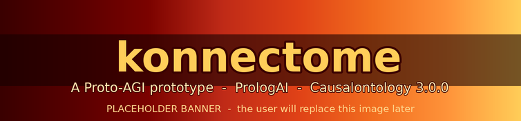

<p align="center">
  
</p>

<!-- THE RACK - ROW 1: THE IDENTITY -->
<p align="center">
  
  <a href="https://github.com/ai-university-aiu/PrologAI"></a>
  <a href="https://github.com/ai-university-aiu/causalontology"></a>
</p>

<!-- ROW 2: THE METHOD -->
<p align="center">
  
  
  
</p>

<!-- ROW 3: THE GATES IT MUST KEEP GREEN -->
<p align="center">
  <a href="https://github.com/ai-university-aiu/PrologAI"></a>
  <a href="https://github.com/ai-university-aiu/PrologAI"></a>
  
</p>

<!-- ROW 4: THE CHARACTER -->
<p align="center">
  
  
  
</p>

<!-- ROW 5: THE LINEAGE -->
<p align="center">
  
  <a href="https://github.com/ai-university-aiu/Mentova"></a>
  
</p>

<p align="center"><sub>The ARC-AGI scores are earned by the reference language, PrologAI, through Mentova - not by konnectome. konnectome inherits them as gates it must never break (Thirteenth Commandment). The banner above is a placeholder the user will replace.</sub></p>

<details>
<summary align="center"><b>What do these badges mean? - a plain-language guide to every ribbon (click to open)</b></summary>

<br>

Each badge above is a claim, and every claim deserves a plain explanation. Here they are, row by row, written for a newcomer. The colored right side of each ribbon runs a single warm fade across the project's official eight-color palette - from bright gold-yellow at the identity, down through the oranges and reds, to a deep crimson-black at the lineage.

**Row 1 - The Identity**

- **`PROTO-AGI | PROTOTYPE`** - Proto-AGI stands for *Proto Artificial General Intelligence*: an early, honest prototype on the road toward a machine that can reason broadly, not a finished general mind. konnectome is that prototype - a build in progress, not a product.
- **`WRITTEN IN | PROLOGAI`** - PrologAI is the glass-box cognitive-architecture programming language konnectome is written in. "Glass-box" means every decision can be inspected and explained, never hidden inside opaque numbers. The badge links to the PrologAI repository.
- **`THOUGHTS IN | CAUSALONTOLOGY 3.0.0`** - Causalontology is the shared data structure that holds konnectome's "thoughts", "chains of thought", and "trees of thought". It is a process-first ontology (an organized vocabulary of causes and effects) where every record is identified by a fingerprint of its own content. konnectome uses version 3.0.0, which is frozen to it except through a gated change-order process.

**Row 2 - The Method**

- **`METHOD | SPARCD 6-PHASE WATERFALL`** - SPARCD stands for Specification, Pseudocode, Architecture, Refinement, Completion, and Demonstration: a six-step waterfall (do each phase in order, writing it down) that konnectome follows and mirrors in six versioned documents called the SPARCD Fileset.
- **`CODE | ENGLISH READABLE CODE`** - English Readable Code (ERC) is a house rule: every single line of code carries one plain-English comment on the line immediately above it, so a newcomer can read the intent without knowing the language.
- **`NAMING | WHOLE-WORD SYSTEM`** - every name is a whole English word in snake_case (like `tick_scheduler`), never a terse abbreviation. "Loop-1", not "L1". This is for clarity, readability, and understandability.

**Row 3 - The Gates It Must Keep Green**

- **`ARC-AGI-1 | 400/400 INHERITED`** and **`ARC-AGI-2 | 120/120 INHERITED`** - ARC-AGI stands for the *Abstraction and Reasoning Corpus for Artificial General Intelligence*, a famous series of public reasoning tests. The reference language PrologAI already solves all 400 of 400 and all 120 of 120 public tasks, by pure readable-logic induction with no Large Language Model. konnectome did not earn these scores; it inherits them as a promise it must never break (the Thirteenth Commandment: any change konnectome asks of PrologAI is additive and must not regress these).
- **`CONFORMANCE | 119 VECTORS GREEN`** - a conformance vector is a published test case (an input and the exact result a correct implementation must produce). Causalontology 3.0.0 has 119 of them, and any data-structure change konnectome proposes must keep all 119 passing.

**Row 4 - The Character**

- **`GLASS BOX | ALWAYS`** - everything konnectome does is inspectable: every decision traces to a named rule you can read. You can always ask "why?" and get a readable answer.
- **`FINDINGS | DISCOVERED BY BUILDING`** - konnectome learns what its cousins still lack by actually building, never by guessing from the armchair. A wall it hits is recorded as a finding first, then routed to exactly one place.
- **`CHANGE ORDERS | ADDITIVE ONLY`** - when konnectome needs something new from Causalontology or PrologAI, the request is additive (it adds, it never breaks what exists) and is gathered into a coordinated package, not forced through.

**Row 5 - The Lineage**

- **`PARENT ORG | AI-UNIVERSITY-AIU`** - the parent organization that owns konnectome and its cousins.
- **`COUSINS | PROLOGAI + CAUSALONTOLOGY + MENTOVA`** - konnectome's sibling repositories: PrologAI (the language), Causalontology (the data structure), and Mentova (the flagship Synthetic Mind and home of the reasoning core). The badge links to Mentova.
- **`STATUS | SCAFFOLDING, BUILD IN PROGRESS`** - the honest current state: the repository is scaffolded (documents, constitution, and the SPARCD Fileset are in place), and the code build has not yet begun.

</details>

# konnectome

> *"The map is drawn. The early camps are reached. The summit is in sight. Let us go forth to the peak: AGI."*
> - Nature's Cognitive Architecture

**A Proto-Artificial-General-Intelligence prototype written in PrologAI, thinking in Causalontology 3.0.0 records, and built faithfully from the appendices of the book *Nature's Cognitive Architecture*. konnectome is the connectome-scale cognitive structure the finished PrologAI language was built to make possible.**

---

## What is konnectome?

**konnectome builds a mind the way nature grows one: smallest faithful slice first, each slice earning the next.** It is the fourth member of a family of sibling repositories owned by ai-university-aiu:

- [**PrologAI**](https://github.com/ai-university-aiu/PrologAI) is the *language* - a glass-box cognitive architecture whose Wave 10 program is complete and load-bearing.
- [**Causalontology**](https://github.com/ai-university-aiu/causalontology) is the *data structure* - a process-first standard for reified causation, frozen at version 3.0.0, in which konnectome stores every thought.
- [**Mentova**](https://github.com/ai-university-aiu/Mentova) is the *flagship Synthetic Mind* and the home of the reasoning core that scores 400 of 400 and 120 of 120 on the two public ARC-AGI benchmarks.
- **konnectome** is the *cognitive structure* - it uses the finished language and the frozen data structure to build the brain-like machine described in *Nature's Cognitive Architecture*, with no workarounds.

konnectome does not edit its cousins in place. When a real build hits a wall the language or the data structure cannot express, that wall is recorded as a finding and routed - additively, and only through a gated change-order process - to exactly one destination.

## How konnectome is governed: the Constitution

konnectome is built and maintained under a written [**CONSTITUTION.md**](CONSTITUTION.md) of fourteen commandments. In brief:

1. **AGI and ASI in mind** - built toward Artificial General Intelligence and Artificial Super Intelligence, guided by three roadmap documents in `docs/`.
2. **Causalontology is the thought structure** - frozen to konnectome except through the gated change-order process.
3. **PrologAI is the language** - the same gate applies; konnectome never edits it directly.
4. **The ledger is the scoreboard** - every wall becomes an entry in [`docs/konnectome_ledger_v1.txt`](docs/konnectome_ledger_v1.txt) first, then is routed to exactly one place.
5. **SPARCD is the waterfall** - the six-phase method, inspired by `docs/SPARCD_EXPLAINED.txt`.
6. **English Readable Code** - one plain-English comment above every line of code.
7. **The SPARCD Fileset** - six versioned documents seeded from the appendices of *Nature's Cognitive Architecture*.
8. **The audit** - every named construct is realized by a module, tracked in a re-runnable coverage list in the ledger.
9. **The archive** - only the latest version of any document lives outside `docs/archive/`.
10. **Mirrored changes** - any code change is mirrored in the SPARCD Fileset, with versions bumped and old versions archived.
11. **The README** - kept current, styled like the cousin repositories, in the crimson-to-gold palette.
12. **Whole-Word System** - whole English words, snake_case, pack-qualified, no terse prefixes.
13. **The safety gate** - no change may regress ARC-AGI-1, ARC-AGI-2, or the 119-vector Causalontology conformance suite.
14. **Branch and report discipline** - feature branches and pull requests; no direct pushes to main; no artificial-intelligence tool credited as author; no Roman numerals.

## The SPARCD Fileset

The six-phase waterfall is mirrored in six versioned documents, each seeded verbatim from the matching appendix of *Nature's Cognitive Architecture* (version 20):

| Phase | File | Seeded from |
|---|---|---|
| 1. Specification | [`docs/konnectome_1_specification_v4.txt`](docs/konnectome_1_specification_v4.txt) | Appendix 1 |
| 2. Pseudocode | [`docs/konnectome_2_pseudocode_v4.txt`](docs/konnectome_2_pseudocode_v4.txt) | Appendix 2 |
| 3. Architecture | [`docs/konnectome_3_architecture_v4.txt`](docs/konnectome_3_architecture_v4.txt) | Appendix 3 |
| 4. Refinement | [`docs/konnectome_4_refinement_v4.txt`](docs/konnectome_4_refinement_v4.txt) | Appendix 4 |
| 5. Completion | [`docs/konnectome_5_completion_v4.txt`](docs/konnectome_5_completion_v4.txt) | Appendix 5 |
| 6. Demonstration | [`docs/konnectome_6_demonstration_v4.txt`](docs/konnectome_6_demonstration_v4.txt) | Appendix 6 |

## The build ladder

konnectome climbs the developmental-milestone ladder of Appendix 6, smallest faithful slice first - and only earns the next rung once the one below it stands:

1. **A heartbeat** - a stable, reproducing tick loop that keeps time.
2. **Senses wired in** - input arriving each tick, with a hidden object held in mind.
3. **Language** - reading and, eventually, chatting from an inner state rather than by next-word prediction.
4. **Reasoning** - logic and causal-reasoning trials.
5. **Emotion and theory of mind** - affective state and modeling another's mind.
6. **Embodiment** - inhabiting a body and using its senses.

The build does not leap to prediction, theory of mind, or a talking mind before the base rungs stand.

## Repository layout

```
konnectome/
  CONSTITUTION.md              The fourteen commandments that govern the build.
  README.md                    This file.
  bin/                         Test runner and the naming / layer / binding gate scripts.
  packs/                       konnectome's Prolog packs, each with pack.pl, prolog/, test/.
    tick_engine/               Slice 1: the scheduler and tick engine (Component 2).
    archetype/                 Slice 2: the six dynamical archetype rules (Section A2.3).
    observer/                  Slice 2: records each tick as a Causalontology token_occurrence.
    connection_graph/          Slice 3: the connection graph (Component 3), signal propagation.
  docs/
    konnectome_1..6_*_vN.txt   The SPARCD Fileset (seeded from the appendices; versioned per slice).
    konnectome_ledger_v1.txt   The running scoreboard of findings (Fourth Commandment).
    konnectome_tutorial_v1.txt A complete beginner tutorial (Fifteenth Commandment), versioned.
    PrologAI_CHANGE_ORDER_v1.txt        Additive PrologAI-language gaps (Third Commandment).
    Causalontology_4_0_0_CHANGE_ORDER_v2.txt   Data-structure gaps for the frozen ontology.
    NATURES_COGNITIVE_ARCHITECTURE_MANUSCRIPT.txt  The source book.
    (plus the guiding-principle and context documents, and the palette)
    images/                    The README banner.
    archive/                   Superseded versions live here (Ninth Commandment).
```

## Status

The build has begun and is climbing the ladder. Three slices have landed on `main`:

- **Slice 1 - the heartbeat** (`tick_engine`): the Scheduler and Tick Engine (Component 2), with the two-pass synchronous update. 7 of 7 tests.
- **Slice 2 - archetypes and the first thought** (`archetype`, `observer`): the six dynamical archetype rules (Appendix 2, Section A2.3) and the observer recording each tick as a Causalontology `token_occurrence` (Component 9) via the reused `causal_core`. 7 of 7 and 6 of 6 tests; the 119 conformance vectors stay green.
- **Slice 3 - the connection graph** (`connection_graph`): the connectome as data (Component 3) - directed, weighted, delayed interfaces - so constructs feed one another tick to tick, with a signal propagating one hop per tick. 4 of 4 tests.

Next: multi-tick delay lines and wiring every archetype through the graph. This README, and every badge on it, is kept honest as the build climbs.

## License and attribution

konnectome follows its family's posture: attribution always, and using it without profit is never a problem. No artificial-intelligence tool is ever credited as an author or co-author, anywhere in this repository (Fourteenth Commandment).
