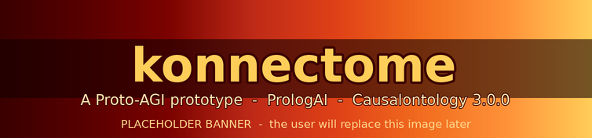

<p align="center">
  
</p>

<!-- THE RACK - ROW 1: THE IDENTITY -->
<p align="center">
  
  <a href="https://github.com/ai-university-aiu/PrologAI"></a>
  <a href="https://github.com/ai-university-aiu/causalontology"></a>
</p>

<!-- ROW 2: THE METHOD -->
<p align="center">
  
  
  
</p>

<!-- ROW 3: THE GATES IT MUST KEEP GREEN -->
<p align="center">
  <a href="https://github.com/ai-university-aiu/PrologAI"></a>
  <a href="https://github.com/ai-university-aiu/PrologAI"></a>
  
</p>

<!-- ROW 4: THE CHARACTER -->
<p align="center">
  
  
  
</p>

<!-- ROW 5: THE LINEAGE -->
<p align="center">
  
  <a href="https://github.com/ai-university-aiu/Mentova"></a>
  
</p>

<p align="center"><sub>The ARC-AGI scores are earned by the reference language, PrologAI, through Mentova - not by konnectome. konnectome inherits them as gates it must never break (Thirteenth Commandment). The banner above is a placeholder the user will replace.</sub></p>

<details>
<summary align="center"><b>What do these badges mean? - a plain-language guide to every ribbon (click to open)</b></summary>

<br>

Each badge above is a claim, and every claim deserves a plain explanation. Here they are, row by row, written for a newcomer. The colored right side of each ribbon runs a single warm fade across the project's official eight-color palette - from bright gold-yellow at the identity, down through the oranges and reds, to a deep crimson-black at the lineage.

**Row 1 - The Identity**

- **`PROTO-AGI | PROTOTYPE`** - Proto-AGI stands for *Proto Artificial General Intelligence*: an early, honest prototype on the road toward a machine that can reason broadly, not a finished general mind. konnectome is that prototype - a build in progress, not a product.
- **`WRITTEN IN | PROLOGAI`** - PrologAI is the glass-box cognitive-architecture programming language konnectome is written in. "Glass-box" means every decision can be inspected and explained, never hidden inside opaque numbers. The badge links to the PrologAI repository.
- **`THOUGHTS IN | CAUSALONTOLOGY 4.0.0`** - Causalontology is the shared data structure that holds konnectome's "thoughts", "chains of thought", and "trees of thought". It is a process-first ontology (an organized vocabulary of causes and effects) where every record is identified by a fingerprint of its own content. konnectome uses version 4.0.0, which added the attitude, predicted_occurrence, and prediction_error kinds; it is frozen to konnectome except through a gated change-order process.

**Row 2 - The Method**

- **`METHOD | DSPARCD 7-PHASE WATERFALL`** - DSPARCD stands for Definition, Specification, Pseudocode, Architecture, Refinement, Completion, and Demonstration: a seven-step waterfall (do each phase in order, writing it down) that konnectome follows and mirrors in seven versioned documents called the DSPARCD Fileset. **Definition** is the newest phase and sits at the **front**: it answers the question every other phase assumes has been answered - what is this thing, and what is it **not**.
- **`CODE | ENGLISH READABLE CODE`** - English Readable Code (ERC) is a house rule: every single line of code carries one plain-English comment on the line immediately above it, so a newcomer can read the intent without knowing the language.
- **`NAMING | WHOLE-WORD SYSTEM`** - every name is a whole English word in snake_case (like `tick_scheduler`), never a terse abbreviation. "Loop-1", not "L1". This is for clarity, readability, and understandability.

**Row 3 - The Gates It Must Keep Green**

- **`ARC-AGI-1 | 400/400 INHERITED`** and **`ARC-AGI-2 | 120/120 INHERITED`** - ARC-AGI stands for the *Abstraction and Reasoning Corpus for Artificial General Intelligence*, a famous series of public reasoning tests. The reference language PrologAI already solves all 400 of 400 and all 120 of 120 public tasks, by pure readable-logic induction with no Large Language Model. konnectome did not earn these scores; it inherits them as a promise it must never break (the Fifteenth Commandment, the Safety Gate: any change konnectome asks of PrologAI is additive and must not regress these).
- **`CONFORMANCE | 137 VECTORS GREEN`** - a conformance vector is a published test case (an input and the exact result a correct implementation must produce). Causalontology 4.0.0 has 137 of them (119 from 3.0.0, plus 18 for the three new kinds), and any data-structure change konnectome proposes must keep all 137 passing.

**Row 4 - The Character**

- **`GLASS BOX | ALWAYS`** - everything konnectome does is inspectable: every decision traces to a named rule you can read. You can always ask "why?" and get a readable answer.
- **`FINDINGS | DISCOVERED BY BUILDING`** - konnectome learns what its cousins still lack by actually building, never by guessing from the armchair. A wall it hits is recorded as a finding first, then routed to exactly one place.
- **`CHANGE ORDERS | ADDITIVE ONLY`** - when konnectome needs something new from Causalontology or PrologAI, the request is additive (it adds, it never breaks what exists) and is gathered into a coordinated package, not forced through.

**Row 5 - The Lineage**

- **`PARENT ORG | AI-UNIVERSITY-AIU`** - the parent organization that owns konnectome and its cousins.
- **`COUSINS | PROLOGAI + CAUSALONTOLOGY + MENTOVA`** - konnectome's sibling repositories: PrologAI (the language), Causalontology (the data structure), and Mentova (the flagship Synthetic Mind and home of the reasoning core). The badge links to Mentova.
- **`STATUS | THE MIND RUNS AND TELLS ITS STORY`** - the honest current state: sixty-two slices have landed (thirty-nine packs, 1,007 tests, all green, four standing gates - the naming gate now carrying its own permanent self-test), all ten architecture components run as one loop, Rung Two of the ladder is open (first grounded words and quarantined pretend play), Rung Three's five trials are all realized (transitive inference with every step shown, seriation, causal-versus-co-occurrence discrimination, means-end planning, categories formed from experience, and a represented model of quantity whose verdict is read by re-measuring, never from a transformation's name), Rung Four is finished (social pain, the empathy trial, and the appraisal and regulation pilots), and one command - `bin/run_capstone_demonstration.sh` - boots the mind and prints its whole glass-box story, which since slice 51 asks its own night watchman whether its night was healthy and reports NOT-YET-MEASURED for the night it actually told, which now reasons step by watchable step, appraises its own situations, regulates its own arousal, and tells the body seam - Rung Five's groundwork - in its own telling, while disclaiming exactly one rung: embodiment.

</details>

# konnectome

> *"The map is drawn. The early camps are reached. The summit is in sight. Let us go forth to the peak: AGI."*
> - Nature's Cognitive Architecture

**A Proto-Artificial-General-Intelligence prototype written in PrologAI, thinking in Causalontology 4.0.0 records, and built faithfully from the appendices of the book *Nature's Cognitive Architecture*. konnectome is the connectome-scale cognitive structure the finished PrologAI language was built to make possible.**

**konnectome is able to** (as one integrated, reproducible, glass-box loop) **keep time** (the tick engine's two-pass synchronous update), **want and stay motivated** (the homeostatic drives, whose relief becomes a reward broadcast as dopamine on the neuromodulatory bus), **act by releasing exactly one action under a vitality safety override** (the action selector and the override controller - a vital drive like breathing can seize control and can never be suppressed), **learn** (the three-factor plasticity engine, where a connection strengthens only when both ends fire together and dopamine says the moment mattered), **record each tick as a Causalontology `token_occurrence`** (the passive observer), and **combine thoughts into chains and trees of thought as Causal Relation Objects** (`thought_combination`) - moving its own body toward what it needs as a closed sensorimotor loop, all as a glass box you can inspect at every step, with the naming, layer, binding, and reality-discipline gates green and the 137 Causalontology conformance vectors intact.

---

## What is konnectome?

**konnectome builds a mind the way nature grows one: smallest faithful slice first, each slice earning the next.** It is the fourth member of a family of sibling repositories owned by ai-university-aiu:

- [**PrologAI**](https://github.com/ai-university-aiu/PrologAI) is the *language* - a glass-box cognitive architecture whose Wave 10 program is complete and load-bearing.
- [**Causalontology**](https://github.com/ai-university-aiu/causalontology) is the *data structure* - a process-first standard for reified causation, frozen at version 4.0.0, in which konnectome stores every thought.
- [**Mentova**](https://github.com/ai-university-aiu/Mentova) is the *flagship Synthetic Mind* and the home of the reasoning core that scores 400 of 400 and 120 of 120 on the two public ARC-AGI benchmarks.
- **konnectome** is the *cognitive structure* - it uses the finished language and the frozen data structure to build the brain-like machine described in *Nature's Cognitive Architecture*, with no workarounds.

konnectome does not edit its cousins in place. When a real build hits a wall the language or the data structure cannot express, that wall is recorded as a finding and routed - additively, and only through a gated change-order process - to exactly one destination.

## How konnectome is governed: the Constitution

konnectome is built and maintained under a written [**CONSTITUTION.md**](CONSTITUTION.md) of **twenty-two commandments**, currently at **version 21**. The numbering below is the Constitution's own. In brief:

1. **AGI and ASI in mind** - built toward Artificial General Intelligence and Artificial Super Intelligence, guided by three roadmap documents in [`docs/principles/`](docs/principles/).
2. **Causalontology is the thought structure** - frozen to konnectome except through the gated change-order process.
3. **PrologAI is the language** - the same gate applies; konnectome never edits it directly.
4. **The ledger is the scoreboard** - every wall becomes an entry in [`docs/konnectome_ledger.txt`](docs/konnectome_ledger.txt) first, then is routed to exactly one place.
5. **DSPARCD is the waterfall** - the seven-phase method, inspired by [`docs/DSPARCD/DSPARCD_EXPLAINED.txt`](docs/DSPARCD/DSPARCD_EXPLAINED.txt).
6. **English Readable Code** - one plain-English comment above every line of code.
7. **The DSPARCD Fileset** - seven versioned documents in [`docs/DSPARCD/`](docs/DSPARCD/); six seeded from the appendices of *Nature's Cognitive Architecture*, and `konnectome_0_definition` written from the Constitution and the whole of `docs/`, leading the other six.
8. **The Vision Document Set** - the thirty-eight-document neuroscience corpus in [`docs/neuroscience/`](docs/neuroscience/), read top-down, informing the project and never breaking it.
9. **The cognitive-architectures test-bed** - a local, read-only study set konnectome should be able to perform the functions of; unachievable means bug, and a kludge is a documented discovery.
10. **The audit** - every named construct is realized by a module, tracked in a re-runnable coverage list in the ledger.
11. **The archive** - only the latest version of any document lives outside [`docs/archive/`](docs/archive/). It governs versions, not series.
12. **Mirrored changes** - any code change is mirrored in the DSPARCD Fileset, with versions bumped and old versions archived.
13. **The README** - kept current, styled like the cousin repositories, in the crimson-to-gold palette.
14. **Whole-Word System** - whole English words, snake_case, pack-qualified, no terse prefixes.
15. **The safety gate** - no change may regress ARC-AGI-1, ARC-AGI-2, or the Causalontology conformance suite. A red gate is a finding to report, never a thing to force through.
16. **Auto-Fix-All** - the owner grants the authority to auto-fix any problem or issue found, on the single condition that what was done and why is recorded in the build log. It sits immediately after the safety gate so the grant and its one inviolable limit are read together: a fix that would redden a gate **stops and is reported**. It is not a licence to edit a cousin, to settle an open design question, or **to cheat** - which is not the same as never choosing a number. See commandment 21. *The sin is not inventing; the sin is disguising.*
17. **Branch and report discipline** - feature branches and pull requests; no direct pushes to main; no artificial-intelligence tool credited as author; no Roman numerals.
18. **The tutorial** - a maintained, beginner-friendly [`docs/konnectome_tutorial`](docs/konnectome_tutorial_v53.txt), kept current and versioned under the archive discipline.
19. **The build log** - every build activity is logged to [`docs/building_konnectome.txt`](docs/building_konnectome.txt), voiced with dual purpose: as a scientific paper and as a best-selling book.
20. **The North Star** - [`THE_NEUROSCIENCE_OF_COGNITION_OUTLINE`](docs/neuroscience/THE_NEUROSCIENCE_OF_COGNITION_OUTLINE.txt) and [`THE_NEUROSCIENCE_OF_COGNITION_MANUSCRIPT`](docs/neuroscience/THE_NEUROSCIENCE_OF_COGNITION_MANUSCRIPT.txt) are the north star, north pole and light-house; [`docs/neuroscience/`](docs/neuroscience/) is the north-star directory. They earn an analysis run of their own and a **gap analysis** that separates what konnectome *could not express* from what it simply *has not built*.
21. **The order of resort** - the order in which konnectome determines a value: logic and reason, then the [neuroscience library](docs/neuroscience/) and the [principles library](docs/principles/), then derivation, then refusal - and only then **declared invention**, as the protocol of *last* resort. Inventing a number to make the system work is permitted and is not a failure: **Edison tested thousands of filaments**, and that search was the method where theory ran out. What makes it legitimate is the declaration - what was tried, why it was chosen, why it worked, and konnectome's authorship on its face in the code. A value the corpus cannot supply marks a hole in the science as much as in the build, and recorded properly it is a candidate contribution *back* to the science of the mind - the way the periodic table's builders wrote down that *something must go here*.
22. **The judgement-call protocol** - a flagged judgement call is WORK, not a resting place. Read the corpus beneath the finding; if it settles the question, **build it in the same act**; if the corpus is silent or out of date, search the published literature. What a search finds goes to [`docs/evidence/`](docs/evidence/) and **never straight into the corpus** - a search result filed inside the north star is *an invented value that has learned to cite* at the scale of a document. Where evidence supports nothing, the refusal stands and is now **stronger**: one that survived a *search* is not the same object as one that survived only a *reading*, and **a negative result is a result**. The corpus is no longer frozen forever - it is kept current by additive, dated, sourced **update runs every tenth hand-off**, never inside a slice, never altering or deleting what it already says.
23. **Context-window management and the hand-off protocol** - when the window runs high, a durable Context Hand-Off is written and the session paused, so a fresh session reloads state from `docs/` and continues from a known-good baseline. **This is the last commandment and remains the last**: a new one is inserted *before* it, never after. It is the protocol a session runs when its context window is full - precisely when it can no longer be trusted to search patiently - so it should be found by going to the end.

## The DSPARCD Fileset

The seven-phase waterfall is mirrored in seven versioned documents. Six are seeded verbatim from the matching appendix of *Nature's Cognitive Architecture* (version 20). The seventh, **Definition**, has no source appendix - the phase is newer than the manuscript - so it is written from [`CONSTITUTION.md`](CONSTITUTION.md) and the whole of `docs/`, and it **leads the other six**: where the Definition and a later phase disagree, the Definition leads.

| Phase | File | Seeded from |
|---|---|---|
| 0. Definition | [`docs/DSPARCD/konnectome_0_definition_v1.txt`](docs/DSPARCD/konnectome_0_definition_v1.txt) | The Constitution and all of `docs/` |
| 1. Specification | [`docs/DSPARCD/konnectome_1_specification_v54.txt`](docs/DSPARCD/konnectome_1_specification_v54.txt) | Appendix 1 |
| 2. Pseudocode | [`docs/DSPARCD/konnectome_2_pseudocode_v54.txt`](docs/DSPARCD/konnectome_2_pseudocode_v54.txt) | Appendix 2 |
| 3. Architecture | [`docs/DSPARCD/konnectome_3_architecture_v54.txt`](docs/DSPARCD/konnectome_3_architecture_v54.txt) | Appendix 3 |
| 4. Refinement | [`docs/DSPARCD/konnectome_4_refinement_v54.txt`](docs/DSPARCD/konnectome_4_refinement_v54.txt) | Appendix 4 |
| 5. Completion | [`docs/DSPARCD/konnectome_5_completion_v54.txt`](docs/DSPARCD/konnectome_5_completion_v54.txt) | Appendix 5 |
| 6. Demonstration | [`docs/DSPARCD/konnectome_6_demonstration_v54.txt`](docs/DSPARCD/konnectome_6_demonstration_v54.txt) | Appendix 6 |

## The build ladder

konnectome climbs the developmental-milestone ladder of Appendix 6, smallest faithful slice first - and only earns the next rung once the one below it stands. The appendix counts the rungs from zero, and so does everything in this repository (the capstone story included):

- **Rung Zero - a heartbeat** - a stable, reproducing tick loop that keeps time.
- **Rung One - senses wired in** - input arriving each tick, with a hidden object held in mind.
- **Rung Two - symbols and language** - words grounded in experience, pretend play, and chatting from an inner state rather than by next-word prediction.
- **Rung Three - reasoning** - logic and causal-reasoning trials.
- **Rung Four - emotion and theory of mind** - affective state and modeling another's mind.
- **Rung Five - embodiment** - inhabiting a body and using its senses.

The build does not leap to prediction, theory of mind, or a talking mind before the base rungs stand.

## Repository layout

```
konnectome/
  CONSTITUTION.md              The twenty-two commandments that govern the build (version 21).
  README.md                    This file.
  bin/                         Test runner, the naming / layer / binding / reality-discipline gates, and run_capstone_demonstration.sh.
  packs/                       konnectome's Prolog packs, each with pack.pl, prolog/, test/.
                               ILLUSTRATIVE, NOT A CURRENT LIST: the packs named below stop at slice 24
                               and thirteen more have been built since. Run `ls packs/` for the real one.
    tick_engine/               Slice 1: the scheduler and tick engine (Component 2).
    archetype/                 Slice 2: the six dynamical archetype rules (Section A2.3).
    observer/                  Slice 2: records each tick as a Causalontology token_occurrence.
    connection_graph/          Slice 3: the connection graph (Component 3), signal propagation.
    neuromodulator_bus/        Slices 4 and 35: the broadcast bus and state announcement service (Component 4).
    drive_system/              Slice 4: the drive system and reward loop (Component 5).
    action_selector/           Slice 5: the action selector (Component 6), releases one action.
    plasticity_engine/         Slice 6: the plasticity engine (Component 8), three-factor learning.
    override_controller/       Slice 7: the override controller (Component 7), the safety property.
    perturbation_interface/    Slice 7: the perturbation interface (Component 10), for experiments.
    cognitive_cycle/           Slice 8: one integrated tick wiring all ten components together.
    thought_combination/       Slice 10: combining thoughts as Causal Relation Objects (chains, trees).
    other_minds/               Slice 11: theory of mind - a false, nested belief (reuses PrologAI theory_of_mind).
    prediction_loop/           Slice 11: the expectation store, comparator, and prediction-error loop.
    self_provenance/           Slice 13: the mind grades, asserts, supersedes, and retracts its own records.
    capstone_demonstration/    Slice 14: the runnable glass-box story of the whole mind.
    symbol_exchange/           Slice 15: first words, grounded in lived experience (reuses PrologAI language).
    pretend_play/              Slice 15: pretend under the five-reality quarantine (reuses PrologAI imagination).
    empathy/                   Slice 16: social pain through the shared drive machinery, and the empathy trial.
    situation_appraisal/       Slice 19: a situation appraised good or bad for the mind's own goals (reuses drive_system).
    arousal_regulation/        Slice 19: an aroused state brought back to baseline (reuses neuromodulator_bus).
    concrete_operations/       Slice 21: Rung Three's logic trials - transitive inference with every step shown.
    cause_and_effect/          Slice 21: Rung Three's causal trials - cause versus co-occurrence, and means-end planning.
    category_formation/        Slice 22: categories the mind formed from its own experience (classification completed).
    quantity_model/            Slice 22: the represented model of quantity - the conservation verdict read by re-measuring.
    simulated_body/            Slice 24: the honestly-named stand-in machine - a camera, a draining battery, three actuators.
    body_interface/            Slice 24: Rung Five groundwork - the book's three body connections; the rung itself not claimed.
  docs/                        Live working documents at the top level; everything else in a sub-directory.
    konnectome_ledger.txt      The running scoreboard of findings (Fourth Commandment). Append-only, and unversioned for the same reason as the build log.
    building_konnectome.txt    The build log (Nineteenth Commandment): the whole story from the true beginning, paper and book at once. Append-only, and the one live document with no version suffix.
    konnectome_tutorial_v56.txt A complete beginner tutorial (Eighteenth Commandment), versioned.
    [DATE]_N_Context_Hand-Off_from_[NAME].txt   The CURRENT hand-off, and the only one here (Twenty-Third Commandment).
    design/                    What konnectome SHOULD be, and how far it falls short: the Eighth Commandment analysis, the four design authorities, the gap analyses, the fidelity audit.
    cousins/                   Documents aimed at the two cousin projects rather than at konnectome: the PrologAI and Causalontology change orders (Third Commandment).
    DSPARCD/                   The DSPARCD Fileset - konnectome_0_definition through _6_demonstration - plus the method spec (Fifth, Seventh).
    neuroscience/              The thirty-eight-document Vision Document Set and the guiding book (Eighth). Source: read, and edited ONLY by the corpus update run (Twenty-Second).
    evidence/                  Published literature searched from OUTSIDE the corpus (Twenty-Second Commandment). OUTRANKED BY THE NORTH STAR, and says so on its own face.
    principles/                What konnectome is built BY and did not write: the First Commandment's three AGI/ASI documents, and the English Readable Code specification (Sixth).
    hand-off/                  Every SUPERSEDED session record. The current one lives one level up.
    provenance/                What konnectome inherited: the record of the ten-wave programme that preceded it.
    archive/                   Superseded VERSIONS live here (Eleventh Commandment) - and only versions.
    images/                    The README banner, and the palette the cousin READMEs are coloured from.
```

## Status

The build has begun and is climbing the ladder. Sixty-two slices have landed on `main` (thirty-nine packs, 1,007 tests, all green):

- **Slice 1 - the heartbeat** (`tick_engine`): the Scheduler and Tick Engine (Component 2), with the two-pass synchronous update. 7 of 7 tests.
- **Slice 2 - archetypes and the first thought** (`archetype`, `observer`): the six dynamical archetype rules (Appendix 2, Section A2.3) and the observer recording each tick as a Causalontology `token_occurrence` (Component 9) via the reused `causal_core`. 7 of 7 and 6 of 6 tests; the 119 conformance vectors stay green.
- **Slice 3 - the connection graph** (`connection_graph`): the connectome as data (Component 3) - directed, weighted, delayed interfaces - so constructs feed one another tick to tick, with a signal propagating one hop per tick. 4 of 4 tests.
- **Slice 4 - the reward loop** (`neuromodulator_bus`, `drive_system`): the neuromodulatory broadcast bus (Component 4) and the homeostatic drive system (Component 5) - reward is the total reduction of drive error, broadcast as dopamine. 4 of 4 and 5 of 5 tests.
- **Slice 5 - the action selector** (`action_selector`): the referee (Component 6) that releases exactly one candidate action - the strongest, drive-biased - and never invents one. 6 of 6 tests.
- **Slice 6 - the plasticity engine** (`plasticity_engine`): the three-factor learning rule (Component 8) - sending activity, receiving activity, and dopamine - that changes connection weights. This closes the loop of the mind: want, act, reward, learn. 5 of 5 tests.
- **Slice 7 - completing the architecture** (`override_controller`, `perturbation_interface`): the override controller (Component 7 - vital drives seize control, the inviolable safety property) and the perturbation interface (Component 10 - lesion, cut, shift for experiments). 4 of 4 and 4 of 4 tests. **All ten architecture components now stand.**
- **Slice 8 - one running tick** (`cognitive_cycle`): all ten components wired into a single end-to-end tick (Section A3.3 order) - the whole mind runs as one loop that wants, acts under its safety override, learns, and records each tick as a Causalontology thought, reproducibly. 4 of 4 tests. **konnectome now runs.**
- **Slice 9 - hardening the loop** (`connection_graph`, `drive_system`, `cognitive_cycle`): the construct gain is now set by the bus, the drives propose the actions, and the body responds to what is done - a **closed sensorimotor loop** where acting to reduce a need moves the body toward its set-point, and that improvement becomes the next reward. 62 tests.
- **Slice 10 - thought combination** (`thought_combination`): konnectome combines thoughts by minting **Causal Relation Objects** via the reused `causal_core` - atomic thoughts as occurrents, combinations as content-addressed CROs, chained into **chains and trees of thought**. 7 of 7 tests; the 119 conformance vectors stay green.
- **Slice 11 - other minds and prediction, the wall-finding build** (`other_minds`, `prediction_loop`): the Rung Four theory-of-mind trial (a false, nested belief, reusing PrologAI's `theory_of_mind`) and the Rung One prediction-error loop (an expected occurrence, and the signed surprise). Both run at runtime - but neither the attributed belief nor the expected-versus-observed discrepancy can be **exported** as a shared Causalontology record, because 3.0.0 has no doxastic or predictive kind. 8 of 8 and 10 of 10 tests; the 119 conformance vectors stay green at Causalontology 3.0.0. **The build's first two walls, Wall-1 and Wall-2, recorded and ROUTED to the Causalontology 4.0.0 change order (Sections A and B released, C/D/E held).**

- **Slice 12 - the closure: minting the new kinds** (`other_minds`, `prediction_loop`): the export half. With **Causalontology 4.0.0** shipped (twenty-one kinds, the conformance suite re-frozen at 137 vectors) and PrologAI's **`causal_core` 1.1.0** making the new kinds mintable, `other_minds` (0.2.0) now mints the attributed belief - true, false, and nested - as **attitude** records and exports the false-belief trial's predicted search as a shareable record, and `prediction_loop` (0.2.0) mints the **predicted_occurrence**, the actual `token_occurrence`, and the **prediction_error** carrying the signed discrepancy. 10 of 10 and 16 of 16 tests; the 137 conformance vectors stay green at Causalontology 4.0.0 in both cousins. **Wall-1, Wall-2, and Wall-3 are all CLOSED** - the two data-structure walls by Causalontology 4.0.0, and Wall-3 (the closure's own wall: `causal_core` could not yet mint the new kinds) by `causal_core` 1.1.0 the same day.

- **Slice 13 - the provenance layer: the mind grades and disowns its own thoughts** (`self_provenance`): konnectome now exercises the Causalontology **provenance tier** over the records it minted at slice 12. It mints an **assertion** about one of its own `attitude`, `predicted_occurrence`, or `prediction_error` records - carrying its own source identity, an **evidence grade** on the standard's ordered scale (`intervention` > `observation` > `simulation` > `derivation` > `human_hint` > `imported`), and a confidence - and a **retraction** that withdraws a prior assertion under the same source (Rule 10), so a disconfirmed forecast is disowned honestly; a confirmed forecast is **superseded** from `simulation` to `observation`. The Rule 25 distinction between an attitude's modelled **holder** and an assertion's signing **source** is demonstrated (conformance vector V135). 17 of 17 tests; the 137 conformance vectors stay green in both cousins. **No new wall** - this slice closes the slice-12 honest non-closure (the mind had minted its records but not yet graded them). One honest limit recorded: the Ed25519 **signature** needs a private key, a secret barred from code (Constraint 3), so signing is a deployment-time act and the minted records carry the public source identity, content-addressed and shareable without it.

- **Slice 14 - the capstone: the mind runs, and its own records tell the story** (`capstone_demonstration`): the repository's first runnable entry point. One command - `bin/run_capstone_demonstration.sh` - boots the whole mind and prints its **glass-box story** in rung order: the heartbeat with per-tick reward, dopamine, one released action, and one observer record; the body regulated to its set-point and the weight grown by the three-factor rule; the object-permanence forecast **confirmed** (signed error zero, stance superseded to `observation`) and **surprised** (signed error minus one, assertion **retracted**); a chain of combined thoughts; the false belief beside the world's contrary record; and the provenance layer standing behind - and honestly disowning - the mind's own stances. Deterministic: told twice, the story is identical. 20 of 20 tests, including independent dynamics checks so the story cannot grade its own homework; the 137 conformance vectors re-measured green in both cousins. **No new wall.**

- **Slice 15 - Rung Two opens: first words and pretend play** (`symbol_exchange`, `pretend_play`): the language rung, opened the honest way. A word may only be **grounded in a condition the mind has lived** - the standard vocabulary (`warm` for the deficit, `settled` for the satisfaction) is built from a real run of the whole mind, and grounding a word in an unlived condition is refused with a named error. Both directions of symbol use work (produce and recognize, the hearing passing through PrologAI's reused `language` word bank), and the pilot's key property is pinned by test: **the mood colours the words** - the same question draws `[warm, settled]` from a too-warm mind and `[settled]` from one at its set-point. Pretend play reuses PrologAI's `imagination` five-reality quarantine: rollouts seal into the `imagined` reality, the observed record is never written by pretending, and **promotion into `observed` is refused outright**. The Section C watch was kept and recorded: **no world-level sharing need arose; the section stays held**. 18 of 18 and 12 of 12 tests. **No new wall.**

- **Slice 16 - Rung Four deepens: social pain and the empathy trial** (`empathy`): the two famous trials, built with architectural restraint - **no bespoke emotion pathway**. The social-pain test re-runs the actual experiment: a `social_connection` drive defends `belonging` as a genuine set-point, a rejection severs it, and the violation registers through the **identical, unchanged drive machinery** that registers a too-warm body (same error, same step, reward -1 broadcast as dopamine) - the shared-circuitry equivalence pinned **number for number** by test. The empathy trial: Ana's **modelled distress resonates into the mind's own belonging**, its own error rises, and the selection flips from a mild physical need to the **helping action** - proposed by the drives, released by the selector, never invented - which restores connection for both. Respiration in distress still seizes control over helping. The attribution travels as a `fears` attitude (the standard's own enumeration), graded `observation`, and **retracted when misattributed** (Rule 10). 17 of 17 tests (plus drive_system 10 of 10 and symbol_exchange 19 of 19). **No new wall.**

- **Slice 17 - the reality-discipline gate: the rule made checkable** (`bin/check_reality_discipline.sh`): the last slice-15 review debt, paid in the method's own coin. The refusal to promote pretend into the `observed` reality lived only in `pretend_play`'s interface while the reused `imagination` crossing predicates stayed callable on the shared library path - so a **fourth standing gate** now refuses any merge in which any pack but `pretend_play` references an imagination-pack predicate (honest comment lines excused). **Proven able to fail before trusted to pass**: a deliberate violation was injected, caught by file and line, and removed. No pack changed, no test count moved - what grew is the set of invariants every merge must prove.

- **Slice 18 - the capstone grows: the story learns Rung Two and the empathy deepening** (`capstone_demonstration` 0.2.0): the one runnable command that tells the whole mind's glass-box story gained **two new chapters**. Rung Two now sounds in the telling - the mind grounds its first words in conditions it actually lived and answers the same question differently in deficit and at rest, then pretends inside the five-reality quarantine with promotion into the observed record refused by name. And Rung Four's deepening joins it - the social pain read through the identical drive machinery, and the empathy trial in which modelling another's distress flips the selection to help, with breath still overriding kindness. Every new chapter carries its own **independent dynamics check**, so the story still cannot grade its own homework, and the printed honest-limits list **shrank by one rung**: Rung Two is no longer named as undemonstrated. Deterministic as ever, told twice identically. 36 of 36 tests (grown from 20); the 137 conformance vectors green in both cousins. **No new wall.**

- **Slice 19 - Rung Four finished: the appraisal and regulation pilots** (`situation_appraisal`, `arousal_regulation`): the rung's last two behaviours, built as thin reuse wrappers with **no eleventh component for emotion and no new Causalontology kind**. `situation_appraisal` judges a situation good or bad for the mind's **own goals**, read straight from the drives' set-point error via `drive_system_error` - a violated set-point is a **threat the mind fears**, a met or improving one is **good and desired** - and owns the verdict as an attitude of the standard's closed enumeration, graded `observation` and **retracted** under Rule 10 when the world corrects it. `arousal_regulation` takes an aroused state carried as **norepinephrine on the neuromodulatory bus** and returns it toward its tonic baseline over ticks, each tick closing half the remaining distance and **settling exactly at baseline, never overshooting** - the same homeostatic discipline the drive system's own capped step keeps. One honest observation recorded (Observation-4): the closed attitude enumeration has no word for *satisfaction*, so a met set-point is approximated as a *desire to keep* it. 12 of 12 and 12 of 12 tests at merge, hardened to 14 of 14 each at slice 20; the 137 conformance vectors green in both cousins. **No new wall.**

- **Slice 20 - the pilots' review debts paid** (`situation_appraisal` 0.1.1, `arousal_regulation` 0.1.1): an independent adversarial review of the two pilots, run after they merged, confirmed three findings - all fixed at root and pinned by permanent tests. The appraisal pilot compared a difference of two rounded set-point errors against exact zero, so a **mathematically-neutral float change** was read as a small good or bad turn and, worse, minted as an attitude the neutral case refuses; a rounding-noise band now reads it as neutral and refuses it. The regulation pilot accepted a **non-finite arousal** (which would never settle); its gatekeeper now requires a finite level. And a fractional-tick refusal gained the test it lacked. Both defects were latent - reachable only by a fractional body or a hand-built infinity - but a confirmed finding is fixed and pinned regardless. 14 of 14 and 14 of 14 tests; **225 in total**. **No new wall; no cousin edited.**

- **Slice 21 - Rung Three opened: the concrete-reasoning trials** (`concrete_operations`, `cause_and_effect`): both layer-0 thin reuse wrappers, with **no eleventh component for reasoning and no new Causalontology kind**. The rung's **smoke test is realized in full**: the block on the cup on the table derives `above(block, table)` and returns **the derivation itself as data** - each step a named operation (`resting_is_above`, `transitive_chain`) carrying the facts it consumed - with a test that walks the steps, so *"every inference is a named, watchable operation"* is enforced rather than asserted. Of the five pilot trials, **three are realized**: seriation; **causal discrimination**, which tells a genuine cause from mere co-occurrence **by the Causalontology causal record itself** (the chain of record identifiers is the justification returned; a record pointing the other way is reported as the *reverse*; two events with no record between them stay **co-occurrence only**; and a **forged record** - shaped right but never minted - is refused by name after its content address is re-derived); and **means-end planning**, breadth-first for the shortest plan, each step justified by the states it leaves and reaches, the plan owned as an `intends` attitude. Conclusions and intentions are graded `derivation`, **never `observation`** - reasoned, not seen. **Two trials are opened only in part, and this is stated plainly**: classification demonstrates the flexible re-sort but **defers categories formed from experience**, and conservation demonstrates the verdict shape over a closed transformation enumeration but **defers a represented model of quantity**. **Rung Three is therefore OPEN, not finished**, and the capstone's honest-limits list still names it. The pre-merge adversarial review confirmed **fourteen findings** (two more refuted and dropped) - the build's largest count - all fixed at root and pinned: a **blocking** silent-wrong-answer where the classifier grouped by unification and accepted unbound values (an object with a blank property joined *every* group); an **exponential** support-cycle check that took 11 seconds at 68 facts and would never have returned at 90 (now linear, pinned by a forty-diamond lattice test); and the **forgery gap** above, which closed the distance between what the causal pack claimed and what it checked. 26 of 26 and 25 of 25 tests; **276 in total**; the 137 conformance vectors **re-measured** green in both cousins. **No new wall; no new observation; no cousin edited.**

- **Slice 22 - Rung Three finished in its trials: the two deferred halves built** (`category_formation`, `quantity_model`): both layer-0 thin reuse wrappers - **no eleventh component, no new Causalontology kind**. Classification is completed the way the book asks: **categories the mind FORMED FROM EXPERIENCE**, induced by PrologAI's `concept_formation` engine (reused unmodified, the first konnectome use of it), sorted into on request, an object fitting none reported `outside_every_category` rather than forced, and the flexible re-sort by a different property delegated to the slice-21 classifier. Conservation is completed as a **represented model**: an amount is individuated units plus an appearance, transformations act on the representation, and the verdict is read by **re-measuring the model, never from the transformation's name** - the receipt is the **lossy pour**, named like a pour, spilling one unit, judged `changed(5, 4)` where every name-list would have said conserved. Both packs **own their conclusions by enactment**: the record predicates accept no quoted text but run the learning episode or the trial themselves and mint what the enactment produced. The adversarial review confirmed **sixteen findings, two blocking** - a silently-wrong sort under an unsorted hand-built core, and an unprefixed helper the naming gate under-detects (recorded in the ledger as a known gate hole) - plus a five-door forgery family (empty core, sentinel name, doubled identifiers, doubled keys, doubled units), all fixed at root and pinned. 26 of 26 and 29 of 29 new tests; **331 in total**; the 137 conformance vectors **re-measured** green in both cousins. **No new wall; no cousin edited.**

- **Slice 23 - The story pays its debts: the capstone grows to 0.3.0** (`capstone_demonstration`): no new pack - the one runnable story learns its two owed chapters. **RUNG THREE, told**: the derivation printed step by named step, the formed categories with their honest `outside_every_category` exile and crossing re-sort, `conserved(5)` with its re-counting reason and the lossy pour caught as `changed(5, 4)`, the sun-and-stone cause citing its record against the rooster's co-occurrence, and the three-step camp plan - **every sentence guarded by a strict live check**, so a drifted engine silences the story rather than letting it lie. **RUNG FOUR, finished in the telling**: the threat owned as a FEARS attitude, the satisfaction owned as a DESIRE-to-keep **with the enumeration's missing word declared aloud** (ledger Observation-4), the honest withdrawal, and the alarm resting **exactly at baseline in eight halving ticks**. The honest-limits list now names **one rung: embodiment**, with the book's own real-machine reason. The suite grew 36 → 44 (rung order, four distinct take-backs, independent dynamics, reproducible identifiers, and a pinned byte-identical double telling); the review interruption is recorded honestly in the ledger as a builder's verification. **339 tests total**; conformance **re-measured** 137/137 in both cousins. **No new wall; no cousin edited.**

- **Slice 24 - Rung Five opened as groundwork: the body seam** (`simulated_body`, `body_interface`): the book demands a *real machine*, so **the rung is NOT claimed** - the capstone still disclaims embodiment - and what stands is the **seam a robot would plug into**, built over an honestly-named stand-in. The three connections, as the book names them: **sensors become senses**, **body state becomes homeostatic state** - so a **low battery is FELT AS HUNGER** through the same `drive_system_error` as every other pain - and **released actions drive actuators**. The **sense-act smoke loop closes in simulation** (obstacle seen → steering released → the camera reads clear again), and the **survival groundwork** drains the battery each tick while the mind recharges **of its own accord**, on a binary-exact rhythm pinned as a literal trace. The interrupted review's two leads were both real and both fixed: an ERC lapse, and an **observation-grade forgery** - a never-enacted record could be stanced as observed; the stance now re-derives the record's content address and refuses forgeries by name. 16 + 21 new tests; **376 total across 27 packs**; conformance **re-measured** 137/137 in both cousins. **No new wall; no cousin edited.**

- **Slice 25 - The story learns the body seam: the capstone grows to 0.4.0** (`capstone_demonstration`): no new pack - the one runnable story gains one chapter, **THE BODY SEAM - RUNG FIVE'S GROUNDWORK, TOLD AND NOT CLAIMED**, between the finished Rung Four and the provenance layer. It opens and closes with the refusal - *there is no real machine here; the rung is NOT claimed* - and in between tells, under strict live guards: the obstacle surfacing as the mind's percept **unchanged**; one closed sense-act pass releasing the steering reflex and leaving the camera clear - **acting changed what the machine will see next**; the **hunger identity** (error 0.5 equals error 0.5 through the one shared `drive_system_error`); the **survival rhythm** - hold at 0.75, recharge **of its own accord** at the pressing 0.5, pinned to the digit; the deliberate **drives-over-reflexes tie**; and the loop record **owned by enacting the pass**, its observation-graded stance granted only after the record is proven genuinely minted. The epilogue keeps the Rung Five disclaimer byte-identical and adds the boundary aloud: **groundwork is not the rung**. Suite 44 → 52 (eight new, including four independent dynamics checks and the reproducible enacted-record identifier); **384 tests total**; conformance **re-measured** 137/137 in both cousins. **No new wall; no cousin edited.**

- **Slice 26 - The naming gate learns to see: the unprefixed-helper hole closed** (`bin/check_pack_naming.sh`): the slice-22 review had proven the gate blind to an **unprefixed helper bearing no known terse stem** (`numlist_or_empty`), and the ledger mandated a hand-hunt in every review since. The gate now carries a **sixth check** that reads the rule as the constitution states it - **every clause head defined in a pack module must begin with the pack's own prefix** (or `prologai_`) - plus a `PACKS_ROOT` override and a **`--self-test` mode**. The proof is **permanent, not injected-then-removed**: a deliberately-broken **fixture pack** under `tests/naming_gate_fixture/` (outside the library path, never loaded, labelled deliberate in its own comments) carries exactly the old blind-spot shape, and the self-test passes **only if the gate catches it by name**. Zero violations across the 27 real packs (no false positives); the **hand-hunt mandate is retired**. No pack changed; **384 tests re-swept green**; conformance **re-measured** 137/137 in both cousins. **No new wall; no cousin edited.**

- **Slice 27 - The delay lines: the connectome learns to keep a signal in transit** (`connection_graph` grown): the interface term's **Delay field becomes load-bearing**. Each transmissive interface gets a **delay line** - a first-in-first-out buffer of Delay−1 in-transit values (the synchronous step delivers the final hop) - threaded through a new delayed step and run as **explicit, stateless values**. Proven, not promised: with every delay at 1 the delayed run **reproduces the plain run exactly** (pinned identity test); a chained 2-tick + 3-tick hop arrives at **exactly tick five and nowhere sooner** - the book's TEST OF PROPAGATION made runnable; a value in transit **survives its source going silent**. The review confirmed **two REAL silent-failure hazards** (an unknown construct kind silently dropped from the state; a ghost source silently destroying a line) - both fixed at root with **refusal clauses that throw by name** across the plain, modulated, and delayed steps, plus delay validation for every interface. Suite 6 → 17 in the pack; **395 tests total**; conformance **re-measured** 137/137 in both cousins. **No new wall; no cousin edited.**

- **Slice 28 - The eligibility trace: a reward one tick late still finds the connection that earned it** (`plasticity_engine` grown): the guiding book's FR-11 and Section A2.6 made runnable. Each transmissive interface gains a **fading eligibility trace** - an explicit, stateless store beside the interfaces, advanced each tick by *trace x fading-factor + coincidence* and **spent** when the reward arrives (*weight += trace x dopamine x learning-rate*). Pinned from the manuscript's own acceptance: activity at tick one, silence at tick two, reward at tick two **still strengthens the weight by exactly the faded trace**; withhold the reward and the trace fades 1 -> 0.9 -> 0.81 while the weight never moves. The review (fourth straight completion) confirmed **four REAL silent failures** - the sharpest: the kind-checking predicate itself would **silently bind an unbound kind to transmissive** via memberchk - plus three MINOR and one STYLE; **all eight fixed at one root**: a shared refusal perimeter judging shape, kinds, duplicates, ghosts, and orphans by name before either new step touches a number, pinned by seven tests. Suite 5 -> 24 in the pack; **414 tests total**; conformance **re-measured** 137/137 in both cousins. **No new wall; no cousin edited.**

- **Slice 29 - Homeostatic scaling: the bound that keeps the learning from exploding** (`plasticity_engine` grown): FR-10's governor. Each construct gains a **running average** (an explicit stateless store, exponential moving average), and a **scaling step** multiplies every incoming transmissive weight of a region by one shared factor - *1 + rate x (target - average)*, **floored at zero** (silenced, never sign-flipped) - so an overactive region's inputs shrink and a quiet one's grow together. Pinned as a deliberate worst case: **fifty ticks of maximal coincidence under relentless full dopamine** hold the weight at a **finite fixed point just below 1.9** where unbounded learning would climb past five. The review (fifth straight completion) confirmed **two REAL silent failures with one shared root** - one malformed store entry drew **two different silent verdicts from two consumers** - plus two MINOR; all fixed at the root: **one shared store judgement** (shape, unbound tails, duplicate keys) for every keyed store in the pack, **mirrored into the slice-28 trace store** and both constructors, pinned by seven tests. Suite 24 -> 48; **438 tests total**; conformance **re-measured** 137/137 in both cousins. **No new wall; no cousin edited.**

- **Slice 30 - Per-territory neuromodulators: the field learns local concentrations, and delayed time learns the bus** (`neuromodulator_bus` + `connection_graph` grown): FR-6's second half. The bus gains **territory entries** beside the global pairs, read by the diffuse-field law - **own level, else global fallback, else silence** - and every construct **is its own territory** (no registry, no caller changes; territory-free buses pinned backward-compatible). The **slice-27 pending line is CLOSED**: a new delayed modulated step carries delay lines and bus together, the gain read **at the tick of delivery, never emission** (pinned both directions), with the all-delays-one identity against the plain modulated step. The review (sixth straight completion) found **no REAL defect** - two MINOR with one root (the flat key space let a compound alias a territory entry; reads silently bound unbound names) closed by **one atom guard at every bus entrance**, pinned by five tests. Suites 4 -> 14 and 17 -> 24; **455 tests total**; conformance **re-measured** 137/137 in both cousins. **No new wall; no cousin edited.**

- **Slice 31 - The per-territory third factor: each connection learns by the chemistry of the place the signal arrives** (`plasticity_engine` grown at its root): the slice-30 pending line **CLOSED**. The live learning step and the reward step now read the dopamine third factor **at the RECEIVING end's territory** through the diffuse-field law - local concentration first, global fallback, silence with neither - so one broadcast reward teaches **different territories different amounts**, and a territory silenced at zero learns **nothing** however loud the global field; on a territory-free bus every weight is **exactly** the old global result (the whole earlier suite passing untouched is the proof). The review (seventh straight completion) confirmed **three REAL findings with one root**, each reproduced first: the live step had **no refusal perimeter** - malformed terms silently failed it, unbound kinds silently skipped learning, duplicate interfaces silently double-learned - closed by the shared interface judgement at its head, pinned by three tests. Suite 48 -> 58; **465 tests total**; conformance **re-measured** 137/137 in both cousins. **No new wall; no cousin edited.**
- **Slice 32 - The live tick carries the whole learning body: traces, averages, and the slow bound beat in the loop** (`cognitive_cycle` grown; the capstone and symbol-exchange boot worlds grown): the slice-31 pending line one **CLOSED**. The world dict gains six keys - the **eligibility-trace store**, the **running-average store**, the fading factor, the smoothing factor, the scaling target, and the scaling rate - read by one world reader that **refuses a missing key aloud by name**, and every tick now beats the learning body in the manuscript's order after the fast three-factor step: traces fade and absorb the tick's coincidences, averages take their smoothing step, and the **homeostatic bound** scales each region's inputs toward its target. Not one engine predicate moved - the stores were always explicit stateless values, so this is a **world-shape change**, and the engine's perimeters now guard the live loop for free. The demonstration worlds carry the bound **armed but at rest** (rate zero) - an at-rest identity test proves an absurd target changes nothing, and a twin live-rate test proves the bound bends a quiet region's weight up. The review (eighth straight completion) confirmed **one REAL finding**, reproduced first: the run's tick-count guard **claimed refusal in its comment while the code just failed** - closed by a named tick-count check refusing the unbound, the non-integer, and the negative aloud, pinned by two tests. Suite 4 -> 11; **472 tests total**; conformance **re-measured** 137/137 in both cousins. **No new wall; no cousin edited.**
- **Slice 33 - The per-territory scaling target: each region defends the activity level its own territory owes** (`plasticity_engine` grown at its root; `cognitive_cycle` grown to read the geography; the boot worlds grown to carry it): the slice-32 pending line one **CLOSED**. The homeostatic bound's target gains a **geography** in the slice-30 diffuse-field law's exact shape: a per-territory target store rides beside the global target - a region with its own target **defends its own set-point**, a region without one defends the global target, and the old one-target step is **re-rooted through the territory step** as its empty-geography case, the identity pinned term for term. The world dict grows one key, `scaling_targets`, refused aloud by name when missing; the three boot worlds carry it **empty - present, honest, unmarked** - and a twin-run test through the live tick proves the geography live. The scaling **rate stays global**, recorded as a boundary, not built speculatively. The review (ninth straight completion) confirmed **one REAL finding**, reproduced first: an unbound target or rate was refused as **a domain error carrying an unbound variable** - a refusal that cannot name its wrong - closed by one guard laid at the shared root of all four numeric-constant checks, pinned by five tests. Suites 58 -> 70 and 11 -> 13; **486 tests total**; conformance **re-measured** 137/137 in both cousins. **No new wall; no cousin edited.**

- **Slice 34 - The bound turned live in the told story: the capstone world carries a live rate and a small geography, and the story shows the bound's work beside a rest twin** (`capstone_demonstration` grown; no other pack changed): the slice-33 pending line **CLOSED**. The capstone's boot world arms the slow bound for real - the diffuse mark at 0.5, the relay `b` defending **its own mark of 0.8** in a one-entry geography, the rate risen from zero to the slow 0.05 - and the story's Rung Zero chapter tells the bound's work **by showing it**: the heartbeat re-lives the same ticks in a **rest twin** (the identical world with the bound at rest) and tells both final weights, claiming the difference as the bound's own work only under a live check that the live weight really stands above the rest one. The other two boot worlds deliberately stay at rest - **one live world is the claim**. The review (tenth straight completion) judged the told-mark-drift candidate **DEFENDED** (tamper-and-catch) and confirmed **one REAL finding** under the unbound-wrong-judgement lens, reproduced first: an unbound tick count refused as a named error **carrying an unbound variable**, closed by the house var guard at the tick gate's head, pinned by two tests. Suite 52 -> 60; **494 tests total**; conformance **re-measured** 137/137 in both cousins. **No new wall; no cousin edited.**

- **Slice 35 - The two-shift switchboard laid: the global operating state rides the bus, online by default, and nothing yet reads it** (`neuromodulator_bus` grown; no other pack changed): slice family one's item (a) **CLOSED**. Designed against the Layer 11 state machinery read in full (Chapters 11-16): the corpus names the broadcast bus itself the **state announcement service**, so the bus now carries a **global operating state** beside its chemical levels - **exactly two values, `online` and `offline`**, a third refused **by name** (the flip-flop's snap made a domain check), defaulting to `online` so **behaviour is pinned identical**: nothing yet reads the state, no existing predicate changed, the capstone's story unchanged by a word. The state's key is a **third key shape** (`global(operating_state)`) the modulator and territory guards can never alias - the review tried on purpose and failed. The review (eleventh straight completion; four named lenses) confirmed **one REAL finding** under the standing unbound-wrong-judgement lens, reproduced first: the state read asked about an **unbound bus** silently bound it around an invented, unbound state; closed by the house var guard at the read's head, pinned by a review test; the same inherited pattern in the older chemical reads **recorded as Observation-5, not fixed speculatively**. Suite 14 -> 23; **503 tests total**; conformance **re-measured** 137/137 in both cousins. **No new wall; no cousin edited.**
- **Slice 36 - The reward learns its address: the tick spends the eligibility traces the drives reward, and capture consumes the spent tags** (`plasticity_engine` and `cognitive_cycle` grown; no other pack changed): slice family one's item (b) **CLOSED**, and with it the pending line every completion document carried since slice 32 (*the reward step still waits for its caller*) - the caller is the live tick itself. Designed against the **Layers 4-5 slow-variables dossier, Part Two (the tagging and capture machinery), read in full**: the synaptic tag IS the eligibility trace (Chapter 5's konnectome note names it outright), the cargo is captured only at tagged synapses (Chapter 6), and **capture CONSUMES** - a served address must expire so it cannot capture a later, unrelated shipment. `plasticity_engine_reward_capture_step/6` spends each trace into its weight at the **receiving territory's own dopamine** (the diffuse-field law unchanged) and consumes the served tag to zero; a zero third factor ships nothing - weight and tag stand bit-identical, the tag left to fade on its own clock. In the tick, capture runs **after the fast learning, before the trace fade, on the traces as the tick found them**, so a reward one tick late finds the trace that earned it and no coincidence is double-counted. The review (twelfth straight completion; four named lenses) confirmed **one REAL finding** under the standing unbound-wrong-judgement lens (paying four slices in a row), reproduced first: the zero-dopamine short-circuit skipped the judging arithmetic, passing unbound values through silently on the commonest path; fixed once, judged on every path, pinned by three review tests plus a fourth pinning the previously untested **punishment path** (a negative third factor spends the tag downward and consumes it). Suites 70 -> 82 and 13 -> 16; **518 tests total**; the capstone's sixty untouched through the rewired tick; conformance **re-measured** 137/137 in both cousins. **No new wall; no cousin edited.**

- **Slice 37 - The night watchman takes the post: the two-process governor rides the live tick and throws the slice-35 switch, its first legitimate thrower** (`two_process_governor` new; `cognitive_cycle` grown; the fixture worlds of `symbol_exchange` and `capstone_demonstration` seat the watchman; no behaviour elsewhere changed): slice family one's item (c) **CLOSED**. Designed against the **Layer 11 state machinery (Chapters 11-16), read in full**: **Process S** (Chapter 14) as a debt rising per waking tick and paid down faster per sleeping tick, floored at zero; **Process C** (Chapter 15) as a triangle day wave set deliberately **against** the debt (the flip-flop judges pressure **less** drive - alertness highest exactly when the debt is greatest, the corpus's cleanest control law); the **flip-flop** (Chapter 11) as two thresholds with the **hysteresis band** between them as Chapter 13's stabiliser in miniature, an inverted band refused by name. Defaults live the corpus's day at one tick per hour (16/2 thresholds over a 24-tick day: roughly sixteen awake, eight asleep, **exactly two transitions in thirty ticks** - the snap proven by the count). The pack is a pure engine (empty requires); the **tick owns the announcing**: at tick's end it reads the standing state, steps the governor, and broadcasts the selection under the slice-35 third key shape. The world gains a required `governor` key; **nothing yet reads the thrown state** - a twin telling pins every other world piece identical, and item (d)'s offline works are the first legitimate reader. The review (thirteenth straight completion; four named lenses) confirmed **one REAL finding** under the standing unbound-wrong-judgement lens (paying **five** slices in a row, found exactly where slice 36 said to look - a silently-failing test): an unbound day length fell through `integer/1` into a domain refusal **carrying the hole itself**; fixed with the house var guard, pinned, plus an honesty pin on the unreachable fractional-phase path. Suites 0 -> 20 and 16 -> 21; **543 tests total**; the capstone's sixty untouched; conformance **re-measured** 137/137 in both cousins. **No new wall; no cousin edited.**

- **Slice 38 - The night crew takes the dark hours: the tick reads the switch the watchman throws, and the offline works run** (`offline_consolidation` new; `cognitive_cycle` grown; `neuromodulator_bus` gains one additive export; the three fixture worlds seat the new keys): slice family one's item (d) **CLOSED**, and with it the sharpest edge the build has carried since slice 35 - **the switch now has a READER**. Designed against the **Layer 11 sleep-state chapters, read in full**: Chapter 7's deep works (systems consolidation by **interleaved replay** against **catastrophic forgetting**, paired with **synaptic renormalisation**) and Chapter 6's spindled encoding queue; Chapter 8's REM theatre and Chapter 9's ultradian wheel are **read and deliberately NOT built**, recorded so the gap is a decision. The tick now **dispatches** on the standing state into two whole programs: the day runs the slice-37 waking tick and then **REMEMBERS** its pattern; the night **closes the sensory gate** (no drives, no proposals, no graph update, no action, no fast learning, no capture, an unmoved body - the corpus's atonia) and runs the works instead. The night invents no new laws: it strengthens through the **same three-factor product** the day uses (third factor pinned at one - the low-aminergic climate as an argument, not a special case) and renormalises through the **same per-territory scaling predicate**, at a raised rate. **The headline test** is a controlled experiment, not an assertion: one cortex, two twins, ten identical nights, differing only in *what* is replayed - the forgetful twin keeps barely a third of the old edge, the interleaved twin nearly **two thirds**, and both install the new. Both end *below* the old edge's start, because the bound washes everything: the claim is **comparative**, and replay **defends** what it refreshes. The review (fourteenth straight completion; four named lenses) returned **SEVEN REAL FINDINGS**, its most productive yet. The unbound-wrong-judgement lens paid for the **sixth slice running**, six times over - an unjudged cortex silently answered as the *empty* cortex, a partial one silently truncated with the caller's tail mutated to agree, a non-list failing in silence, an unbound kind reporting an edge consolidated that was never replayed, a **hole at an edge's endpoint BOUND by the replay's own lookup** (inventing a connection no caller declared), and an unjudged operating state letting **one tick run BOTH whole programs**. The default-drift lens paid twice, the second being **the slice's deepest finding**: measured end to end the night was **multiplying the weight by more than ten** against a target of one half - the inverse of the renormalisation it exists to perform - because the replay dose was paid *per remembered pattern* while the bound stayed one fixed step, so two opposed forces were measured in different units; **and the suite's own night assertion had enshrined the growth**. The dose is now shared across the batch and invariant to store size (multiplier 10.5 -> 1.17), and the twin telling was **rewritten around the honest measured numbers**. All seven fixed at their roots, pinned by **eleven review tests**; key-shape aliasing and behaviour-pinned-identical returned **DEFENDED** (a fifteen-tick online run bit-identical to `main`, re-verified after every fix). Suites 0 -> 27 and 21 -> 34; **583 tests total**; the capstone's sixty untouched; conformance **re-measured** 137/137 in both cousins. **No new wall; no cousin edited.**
- **Slice 39 - Every construct becomes a hybrid automaton: the register of one, stated proudly** (`mode_register` new; `connection_graph` and `tick_engine` rewired to read every construct's rule THROUGH its register): the first build slice of the **mode-register family**, designed against `docs/design/05_mode_register_design_authority_v1.txt` - the deep read of the corpus's **fourteen MODES companions** plus the Layer 6 chapter template. Its headline finding is that **konnectome did not have to design a mode register**: the corpus specifies one, in identical words, beside every layer - *STATE is the continuous instantaneous condition; MODE is the discrete operating regime; the formalism is the* **hybrid automaton** *- mode register, per-mode transfer functions, transition table, fault watchdogs*. konnectome names the term what the corpus names it and carries **all four blocks**, with timescale and **AGENCY** mandatory on a transition row, **no guard column** (the corpus folds guards into the trigger clause), and the fault block present and **permanently empty** until the supervisor channel exists, because the template forbids admitting faults as modes *by name*. **A REGISTER OF ONE IS FIRST-CLASS, NOT DEGENERATE** - the corpus says so three separate times, and states the interpretation directly: *the length of a register is a statement of what the system trusts the component to decide*. So konnectome's single-rule constructs were never a debt; they are faithful **mode-poor** components, and all six now say so: the free-running clock (**the Metronome**), the committed copy (**the Echo**), the held value (**the Kept Reading**), the clamped input (**the Clamped Window**), the tonic relay (**the Faithful Relay**), the modulated tonic relay (**the Listening Relay**). **The per-mode transfer function is the construct kind term ITSELF**, which makes the bit-identical promise a **law**, pinned across all six kinds - and an unregistered kind has no register and **passes through unchanged**, so each engine's own refusal stays the sole authority on what it accepts. **Proved, not asserted**: the whole capstone story is **byte-for-byte identical** to a `main` worktree, fingerprints included, and a **114-line engine probe** (40 heartbeat runs, 52 graph runs plain and delay-honouring, 20 bus-modulated steps, both refusal terms) is identical to the last digit. **The probe earned its keep**: exactly one path differs, no world can reach it, and it is **declared rather than buried** - on `main`, a construct with an **unbound kind** unified with all three heartbeat clause heads, so one construct produced **three contradictory values** and the state silently **grew**; the register refuses it at the door. The **unbound-wrong-judgement lens has now paid seven slices running**. The **MODE-flag naming collision is CLOSED as a recorded decision, not a rename** - re-verified that no directed-versus-broadcast flag exists in `packs/*/prolog` or in causalontology, so `MODE` is reserved for the corpus sense, `archetype`'s gate vocabulary is already correct and stays, and any future flag enters as **TOPOLOGY**. Suite 0 -> 40, 24 -> 26, 7 -> 8; **626 tests total** across **30 packs**; conformance **re-measured** 137/137 in both cousins. **No new wall; no cousin edited.**

- **Slice 40 - The gate archetype re-expressed as its genuine two-mode register** (`archetype`): the design authority's **Part Nine slice three**, and the slice where the formalism stops being a promise. Slice 39 gave every construct a register of **one** - first-class, proudly stated, and also the one register length at which the register block, the transfer block and the current-mode slot have nothing to disagree about. The gate is the seed the deep read named: of thirty-nine slices' worth of constructs, it is the only one that already behaved the way the corpus says components behave, and its `open`/`closed` vocabulary was **already corpus-correct and forbidden to rename**. It now carries all four blocks - a **register of two** in the corpus's three-field schema (`open` - **the Open Sluice**; `closed` - **the Dropped Shutter**), **per-mode transfer functions that genuinely differ and are genuinely applied** (four units through an open gate give four; through a closed gate give nothing - one predicate, one input, two modes, two machines), an **explicit transition table** of two rows carrying trigger, direction, **mandatory timescale** and **mandatory agency** with no guard column, and the fault block present and **empty** until the supervisor channel exists. **The table is now the sole authority on direction** - the old two-clause flip table is gone - so when the bus throws a transition it will be a row in the same table, judged by the same constructor. **Validated block by block against a corpus entry whose register is two**: the Layer 8 modes volume's **Entry 36, the mutual-inhibition flip-flop (the Either-Or Latch)** - and the one place the shapes differ is **declared, not smoothed over**: the corpus's latch is **hysteretic**, konnectome's gate is a **symmetric toggle** sharing one threshold both ways. Not fixed here, because the corpus itself puts the stickiness in a **separate stabiliser** that is *"not part of the switch"*; logged as **OBSERVATION-8** with the stabiliser slice named as its closer. **The current mode belongs to the INSTANCE, not the kind** - settled here, because two gates of one kind stand in different modes at the same instant, and every remaining slice in the family depends on it. **Proved, not asserted**: a **321-line archetype probe** (the gate across 2 modes x 11 drives x 11 thresholds, the dispatch, and the five untouched archetypes) and the whole **112-line capstone story** are **byte-for-byte identical** to a `main` worktree. **The probe earned its keep again** - **four** declared divergences, all malformed calls no world reaches: on `main` a gate standing in a **blank** was answered as though it stood open (a mode belonging to nobody written into the caller's hole), a blank below threshold was answered by **aliasing**, the foreign atom `ajar` was handed straight back out, and `ajar` above threshold **failed in silence**. All four now refuse aloud. **The review - the sixteenth straight completion - returned three findings, all in the new code**: the departure lookup guarded at each caller instead of **where the routes meet** (slice 39's own lesson arriving one slice later), the trigger atom **spelled twice** so a rename would have failed in silence, and the closed gate's law **never reading its input** so a hole would have been answered with a confident zero. The **observability the owner's standing visualization request depends on** is pinned by a named test: a watcher holding only a gate's mode name reads back the mode and the rule in force **without running the gate**. Suite 7 -> 29; **648 tests total** across **30 packs**; conformance **re-measured** 137/137 in both cousins. **No new wall; no cousin edited.**

- **Slice 41 - The bus throws a transition** (`neuromodulator_bus`, `archetype`, `mode_register`): the design authority's **Part Nine slice four**, and the slice where **one write produces many coordinated register transitions**. The corpus's own coordination answer is that there is **no derivation function** from a parent's mode to a child's - it denies the reduction twice - and that what coordinates is **one broadcast, written once and read many times**. konnectome owned the broadcast; it did not own a broadcast that carries a **MODE** rather than a level. The bus gains a **fourth key shape**, `mode_throw(ConstructKind)`, beside the plain-atom modulator, `territory/2` and `global/1` - a write, a read, a **withdrawal**, and a domain check - addressed to a **KIND, never an individual** (a broadcast that could name one construct would be a wire), and **silence is given a reserved name** (`no_mode_thrown`, which the write itself refuses) so a reader can never mistake nothing-said for an instruction. **THE COMMAND-VERSUS-BIAS DECISION IS MADE HERE AND RECORDED AS KONNECTOME'S OWN**, because the corpus genuinely supports both readings and the design authority, the Theme Two read and the Theme Four read all raised it independently: **a thrown mode is a COMMAND at the discrete grain, and bias is the channel konnectome already has**. Three reasons, all konnectome's: it **un-conflates** two operations the design authority says are conflated (the modulated relay already IS the bias, so a bias-throw would leave konnectome with two biases and no command); a command **costs no invented number** where a bias must invent a threshold offset; and command is the **reversible** choice, since a bias agency can later write rows into the same table. The conflict rule follows and is also konnectome's own: **the throw PREEMPTS** self-selection while it stands - chosen because it is the rule that can be **read without running the construct**, which the owner's standing visualization request demands - with **negotiated arbitration deferred by name**, not denied. **THE THROW IS A ROW, NOT A BACK DOOR**: two new rows join the gate's table, differing only in the **AGENCY** column that read `self_selected` on every row konnectome had ever written, so **a construct that declares no thrown row simply cannot be commanded** - and it says so through its own register rather than through a list of who may boss whom. **The archetype pack still does not import the bus**: a rule library that reached for a global channel would stop being one, so the join belongs to the caller and the test suite stands in for one. **The default-drift lens paid out before it cost anything**: slice 40's departure lookup took the *first* row leaving a mode, which stays correct after this slice **purely by accident of declaration order** and would break in silence on any reordering - a lookup that is right because of the order things were written in **is not right, it is lucky** - so `mode_register` gains a departure lookup **keyed on agency**, which also **refuses ambiguity aloud** rather than preferring the earlier row. The **unbound-wrong-judgement lens paid for the ninth slice running** (unbound agency, unbound construct kind at the read, unbound bus), and key-shape aliasing returned **DEFENDED** and **PINNED** - four channels written to one bus with the throw deliberately aimed at a kind sharing a **modulator's own name**, all four read back clean. **Proved, not asserted**: a **387-line probe** in a `main` worktree came back **386 lines identical**, the single divergence being **the transition table this slice exists to grow**, and the whole **112-line capstone story** is byte-for-byte identical. Suites 23 -> 36, 29 -> 40, 40 -> 45; **677 tests total** across **30 packs**. Conformance **not re-measured** this slice, honestly, because neither cousin was touched. **No new wall; no cousin edited.**

- **Slice 42 - The supervisor channel: fault regimes watched and published as warnings, never admitted as modes** (`supervisor` new; `archetype`'s gate fault block filled): the design authority's **Part Nine slice five**, and the closing of an **IOU three slices old**. The Layer 6 template forbids admitting a fault as a first-class mode **by name**, and konnectome had honoured that since slice 39 by leaving every fault block present and **empty** - correct, and also a debt, because the block could not honestly be filled until something existed to do the watching. **The distinction is worth a pack rather than a convention**: a mode **has a transfer function** (while it holds, the construct runs a different machine, on purpose), and a fault **has none and never will** (it is a boundary the construct was not designed to cross). A fault admitted as a mode would give the system **a designed behaviour for being broken**, which it would then run silently and forever - **a machine with an official way to be broken never reports being broken**. So `supervisor_faults_are_not_modes/1` **refuses** a register whose fault signature is also a declared mode, and the refusal fires on the way into every watch. **THREE OUTCOMES, NOT TWO, AND THE THIRD IS THE POINT**: a regime is **warned**, **clean**, or **UNWATCHED**. An empty warning list cannot distinguish *watched and healthy* from *nobody looked*, and the second is the dangerous one - so silence has to name itself, and a construct kind nobody has watched reads back as *no watch happened*, never as a clean bill of health. **The gate's two fault regimes are the corpus's own**, from the same Entry 36 latch slice 40 validated against: **oscillation** (failing by never settling) and **stuck switch** (failing the opposite way). **konnectome invents no threshold** - every reading carries its own allowance, supplied by the caller that owns the watchdog - and the boundary case is pinned: exactly *at* the allowance is not *across* it. **The channel is deliberately NOT a key on the neuromodulator bus**: a warning is not a chemical and is addressed **outward**, and putting it on the bus would make every construct's update rule a potential reader of its own failure report. **The supervisor cannot move anything** - no path to a mode, no row in any table - pinned by a test that warns about a gate and then asserts its mode and rule are unchanged. **The declaration-order lens paid on its first outing**, one slice after it was earned: two watchdogs reporting on one boundary are **refused**, not resolved in favour of the first. The unbound-wrong-judgement lens paid for the **tenth slice running**, five times in new code. **Proved, not asserted**: the slice-41 probe re-run unchanged came back **387 of 387 identical** - no divergences at all - and the 112-line capstone story is byte-for-byte identical. **Honest non-closure, logged as OBSERVATION-9**: konnectome now has a **watcher and no watchdogs**; nothing counts a gate's flips yet, so every fault regime reports as *unwatched*, which is exactly why the third outcome had to ship with the first two. **WATCH-3 examined and still a watch** - a warning is computed inside one runtime and travels to nobody, so it fails the consumer-versus-ontology test and routes nowhere. New suite 27; archetype 40 -> 42; **706 tests total** across **31 packs**. **No new wall; no cousin edited.**
- **Slice 43 - The ticks-per-second convention: one hundred ticks to the nominal second, declared and refused rather than rounded** (`tick_engine`; three exported predicates, no new pack): Family Four item **2** of the version 2 vision-set analysis, **promoted ahead of the stabiliser** because the same missing number had arrived from **three independent directions** - beneath Theme Four and Theme Five in the analysis, and again in slice 42, where a watchdog turned out to need a **window** and konnectome had no unit to state one in. **A cheap item that arrives from a third independent direction has stopped being a queue item and has become a dependency.** **The problem**: konnectome counts in **ticks** (dimensionless ordinals) and the corpus counts in **seconds** - ignition near 300 ms, admission in the low hundreds, unrehearsed decay in seconds, a board wiped in under a second - and **the corpus cannot answer this question**, because it describes a continuous system and has no opinion about how often a synthetic mind should update. So it is **DECISION-2**, konnectome's own, recorded in the ledger with reasons and with what it does **not** decide. **The three reasons**: every corpus constant becomes a **whole number of ticks** (300 ms is 30 ticks exactly), so nobody ever rounds - and **a rounding is an invented number wearing a small coat**, which is how the no-invented-numbers promise would have been broken quietly rather than loudly; it is the **coarsest** rate that does so, because the corpus states these quantities to a hundred-millisecond grain and a finer tick would claim precision the source does not have; and it is **reversible**, since every duration passes through **one** conversion predicate and no running behaviour moves by a single count. **The refusal is the load-bearing half**: a duration that is not a whole number of ticks is refused aloud with `domain_error(whole_tick_duration, Milliseconds)`, **never rounded**, so the caller must decide in the open. Both conversions also refuse an **unbound** argument - the unbound-wrong-judgement lens paying for the **eleventh slice running**. **What it does not do, pinned by a test**: konnectome is **not** real-time; nothing sleeps, nothing measures, and five ticks still reads five. **Honest non-closure, logged as OBSERVATION-10**: the observer's stamp still advances **one second per tick** and now disagrees with the convention by a factor of a hundred - harmless today because the stamp is an identity carrier and nothing subtracts two of them, dangerous the day someone reads the trace as a timeline, and **not fixed speculatively** because restating it would re-mint every content-addressed identifier in the repository. **OBSERVATION-9 is unblocked, not closed** - the convention supplies the unit a window can be stated in; the window's length is still a decision somebody must make and justify. `tick_engine` 8 -> 15; **713 tests total** across **31 packs**; capstone story byte-identical. **No new wall; no cousin edited.**
- **Slice 44 - The stabiliser: hysteresis published as a scalar, and the gate becomes the corpus's latch** (`stabiliser` new; `archetype` gains a second boundary): the design authority's **Part Nine slice six**, and **the closer OBSERVATION-8 named when it was opened four slices ago**. **The corpus is explicit that hysteresis is not part of the switch** - *this is a stabiliser, not a switch, so it has no poles of its own* - and konnectome's hysteresis was two constants inside the two-process governor and one symmetric threshold inside the gate: **the stickiness buried in the switch**, which is the arrangement the corpus names and rejects. Slice 40 recorded the gap and **refused to fix it where it found it**, because a second constant inside `archetype_gate/4` would have gone green while modelling the corpus wrongly. **DECISION-1 applied, not re-opened**: a hysteresis scalar is a **bias**, so it travels as a **level** under a plain-atom key - proved rather than asserted, since the published value reads back through the bus's *ordinary* level read. **The stabiliser's agency is `broadcast_bias` and it is an agency in NO transition table** - the sharpest available statement of what a bias is, pinned by a test that first checks the table is non-empty so it cannot pass vacuously. **The stabiliser moves nothing**; it changes *where a boundary sits*, and the construct's own row then fires, or does not, by its own rule. **DECISION-3**: the published scalar governs **the construct grain only** - the version 2 analysis's sharpest ambiguity, because the corpus puts the stickiness *outside* the switch at one grain and *inside* the motif at another, and both are literal - with three reasons that are konnectome's own, and **made a refusal rather than a comment**. **OBSERVATION-8 CLOSED**: `archetype_gate_hysteretic/5` gives the gate two boundaries, and **at a bias of zero they coincide and the latch is the old symmetric toggle exactly**, so every switch can consult the stabiliser, find the bus's default silence, and behave as before. **The rejected mapping is recorded because it is the one the next reader will reach for**: making turn-on cost *threshold plus bias* and turn-off *threshold minus* it reads like the corpus's higher-and-lower boundaries, and with a push-drive it makes `closed` **absorbing** - a gate that settles and never leaves, which is the corpus's own **stuck switch** fault signature, listed in this very pack since slice 42. **A hysteresis design that manufactures a fault regime is not a hysteresis design.** **The governor's two constants are now derived, and not one number changed**: 16 and 2 are restated as a midpoint of 9 and a half-width of 7, and a test runs a full 24-tick day on both and checks they match tick for tick - *identical parameters are evidence; identical behaviour is proof*. **An honest interaction pinned rather than discovered**: the gate accepts a zero bias and the governor refuses one, because a zero-width band is the chattering it has forbidden since it was built. **Deferred by name, not invented**: the corpus gates the stabiliser by circadian phase and **hunger**, and konnectome has no hunger at all. New suite 18; archetype 42 -> 50; **739 tests total** across **32 packs**; capstone byte-identical. **No new wall; no cousin edited.**

- **Slice 45 - The first real watchdog: a windowed history, and the end of a repository in which nothing was watched** (`watchdog` new; **no existing pack edited**): **OBSERVATION-9 CLOSED**, opened at slice 42, unblocked at slice 43, and the **second observation this build has ever closed** - the first having been OBSERVATION-8 one slice earlier. Slice 42 built a supervisor that judges readings it is **handed** and keeps no history, so **konnectome had a watcher and no watchdogs** and every fault regime in the repository came back `UNWATCHED` *by name* - which is exactly why that pack was built with **three** outcomes rather than two. A history is a list of `observation(Tick, Mode)` held newest-first and threaded through the caller as **a value the world carries**, in the eligibility-trace store's discipline, so a watcher can read the current mode, the span measured and both readings **without running the construct**. Two readings, and **neither boundary is konnectome's invention**: flips-in-a-window and ticks-held-in-a-mode, offered under the very signatures `archetype`'s fault block has declared since slice 42, from the Layer 8 modes volume's **Entry 36, the Either-Or Latch**, which names exactly those two ways such a switch fails. **DECISION-4**, in two halves. **First, the window belongs to the caller**, as the allowance already did - and the slice *looked* for a corpus number before declining to invent one: Entry 36's *minutes to hours* is a claim about the **sleep-wake** latch, konnectome installs this gate where sleep is irrelevant, and adopting it would put the window at tens of thousands of ticks and make the capstone's own **ten-tick heartbeat permanently unmeasurable** - while wearing a citation that does not cover the case. **A default with a borrowed warrant is an invented number that has learned to cite** (the cousin of slice 43's *a rounding is an invented number wearing a small coat*). **Second, and this is the half with teeth: a window the history does not yet span is reported as NOT-YET-MEASURED, never as clean.** A four-tick history asked for a twenty-tick window *could* honestly answer "one flip so far" - and the supervisor would then publish **a clean bill of health for a boundary nobody has watched long enough to judge**, defeating that third outcome from one layer underneath. So it hands back **nothing**, plus the window asked and the span held, and both boundaries flow through the `UNWATCHED` block, which is true. **A system that only knows how to answer will answer when it should not** - now written into konnectome twice, at two layers, by two packs. **Proved at the watcher, not asserted at the watchdog**: named tests drive the **real** gate's automaton through the **real** supervisor, one reading back an **empty unwatched block** (a sentence this repository could not say before), one leaving both boundaries unwatched by name. **Time does not run backwards and does not stand still**: an observation at a tick not strictly later is refused with `domain_error(watchdog_advancing_tick, Tick)`, because rewriting history and double-counting a tick both look like ordinary use while poisoning every later verdict - the precise fault this pack exists to catch in others. **An honest sampling limit, named not hidden**: a window is counted in **ticks** but flips between consecutive **observations**, so a caller that samples gets ticks-held exactly and an **undercount** of flips. **Nothing is wired yet**: no caller builds a history, which is why the capstone story is byte-identical, and the first slice that joins one must choose a window and say why. New suite 29; **768 tests total** across **33 packs**; four gates at zero; capstone byte-identical. **No new wall; no cousin edited** - conformance is now **six sessions old** and must be re-measured before it is quoted.

- **Slice 46 - The master register widened: a pole, a sub-mode, and the downward assignment** (`master_register` new; `neuromodulator_bus` state channel widened): the design authority's **Part Nine slice SEVEN - the LAST NAMED SLICE of the mode-register family**, which began at slice 39 and which planned seven and built nine. Layer 11's own claim is that **a global state is not a flag**: it *is* a **coordinated assignment of modes** across everything below, which is why all twenty-six of its chapters carry a section headed THE DOWNWARD ASSIGNMENT. konnectome walked into that at slice 35 without naming it - the online/offline binary **was** the master register in degenerate form, with nothing beneath it to assign. **DECISION-5**, in two halves. **The binary is preserved as the POLE** with four corpus-named sub-modes beneath each: the corpus catalogues the **sleep-wake flip-flop as its own bistable entry** with a family on each side, so dissolving the binary would have discarded a distinction the corpus draws with a dedicated chapter and left slice 37's governor with nothing to switch *between*; and it costs no existing caller anything, because the original reader still returns **the pole alone** and always will. **The assignment is keyed on the WHOLE state**, so a sub-mode *may* change it - answering Part Seven item 4, which the corpus does not settle - because N2's and N3's assignments are **different mode names at the same grain, not one assignment at two strengths**. **The roster is the corpus's; the CUT from twenty-six to eight is konnectome's** (machinery, overlay states, a whole-night program and the pathological configurations all excluded - admitting them would be slice 42's *fault-is-not-a-mode* error one grain higher). **The two defaults are the corpus's too**: waking is *the default assumption of nearly every cognitive experiment ever run*, and offline is **slow-wave sleep** because that is the state whose assignment names consolidation and renormalisation - *precisely and only what `offline_consolidation` has done since slice 38*. **Channel judges shape, register judges policy** - pinned from both sides, including a test that writes a roster violation through the raw channel. **OBSERVATION-11**: the assignment table **ships empty**, because **the corpus assigns to NAMED INDIVIDUALS and konnectome has only KINDS** - so "waking assigns every gate `open`" is one line away, reads like fidelity, and would set *every gate in the repository* to the mode of *one named flip-flop*. **A default with a borrowed warrant is an invented value that has learned to cite** - a number last slice, a mode name this one. Closer named: the **region-grain construct**. **The mechanism is proved against a fixture**, not the empty table, and a kind neither row named reads back as silence (slice 41's *row, not a door*). New suite 28; **796 tests total** across **34 packs**; capstone byte-identical. **Conformance RE-MEASURED this session, retiring the repository's stalest claim**: **137/137** in PrologAI (`ebbc3e0`) and **137/137** in causalontology's Python binding (`292dfca`) - both *run*, with the honest qualification that 137 is 137 **checks**, 38 shared and 99 per-binding. **No new wall; no cousin edited.**

- **Slice 47 - The first caller wired to a watchdog: the sleep-wake flip-flop becomes a register and gets watched** (`two_process_governor` gains a register, a fault block and a watch; **no new pack** - it joins four that already existed): **the debt slice 45 left in the open**, paid two slices later. **Why the governor and not the gate, which is why this could succeed where slice 45 was right to refuse**: konnectome has two constructs answering to the corpus's flip-flop entry, and **the governor has a cycle of its own and the gate does not** - a window is a duration and a duration is only meaningful against something. **DECISION-6: the window is not a number, it is the governor's OWN DAY, read from its own parameter block**, and both allowances derive from the same day. Slice 45 rejected the corpus's *minutes to hours* and was right - but that sentence was never about hours, it was **minutes-to-hours against a twenty-four-hour clock, a FRACTION OF A CYCLE**, and konnectome's governor has a cycle. Give it a twelve-tick day and window and allowances follow in the same tick, pinned by a test. **The chatter allowance is two crossings because that is what a healthy day of this switch IS** - one down, one up - and a third is the corpus's own state intrusion; the lock allowance is the day less one tick. **And the allowance is tested for MEANING**: a test asserts the real governor's real day *reaches* two rather than sitting safely below, because an allowance nothing approaches has never been tested by the thing it governs. **The flip-flop becomes a register**, validated against Layer 11's Entry 11 block by block, with the entry's own coined pole names - and its sharpest sentence made checkable: the crossings are *thrown by Process S and Process C, NOT internal to the switch*, so **no row carries `self_selected`**, proved over a table first checked non-empty. **One divergence recorded rather than smoothed over, and it costs a fault regime**: Entry 11's mid-band signature is NOT declared, because konnectome's switch has no mid-band to linger in - and **a fault regime that cannot be crossed is not a conservative addition, it is a permanent false negative in the one block whose job is to make absences visible**. **The demonstration**: a real governor runs a real day into a real history judged by the real supervisor - **nothing warned, nothing unwatched**. Stop four ticks in and both boundaries come back **unwatched by name** - and *nobody wrote code for that*: DECISION-4's second half fell out of composition unassisted. **Honest limit**: the capstone does **not** call it, so the story is byte-identical and konnectome's told story still cannot say whether its night was healthy - a demonstration slice, now a small one. New tests 20 -> 35; **811 tests total** across **34 packs**. **No new wall; no cousin edited.**
- **Slice 48 - The bus's six named broadcast channels: a roster that declares and does not guard** (`neuromodulator_bus` gains a roster; **no new pack**, no existing call changed): the **first item of Family Four**, which the vision-set analysis at **version 3** moved to the front of the whole queue the same day, and the first slice built since the mode-register family closed. The roster is **Layer 11's Chapter 16 - the Ascending Broadcast System, this pack's own chapter** - which names the six in one sentence; each channel's **role is the Layer 10 systems volume's own chapter subtitle** (chapters 31 to 36) and each channel's **COG / NON-COG tag is that heading's own**, so **nothing in the roster is konnectome's invention**. **DECISION-7**, in two halves and a refusal. **The roster DECLARES and does not GUARD**, and the reason is a *measurement*: **the modulator keyspace is a NAMESPACE and not a roster** - `stability_bias` has ridden the same atom keyspace since slice 44 and is not a neuromodulator, so a roster enforced on write would have refused a correct, running, tested caller. The check is written, exported and **applied to nothing**. **The corpus writes *noradrenaline* and this machine has broadcast `norepinephrine` since slice 19**, so the roster is declared in the machine's word and the corpus's word **resolves onto it** - because **this bus answers an unknown key with ZERO**, and a caller reading the corpus's spelling off a live channel would be told, in perfect silence, that arousal is at baseline. **A plausible answer is worse than an error**, and a second key would have made it permanent. The test asserts *both* halves: the resolved read finds the real level, and the unresolved read would have found a plausible zero. **And no per-channel default level is declared** - the corpus's 0.3 and 0.5s are *initial values inside worked pseudocode*, there is none at all for histamine or orexin, and the corpus's own statement is that **the blend, not any single chemical, names the mode**. **A default with a borrowed warrant** arrives a third time - a number at slice 45, a mode name at slice 46, a **level** here - and is refused a third time. **OBSERVATION-12**: this item's own honest note (*"only dopamine is actually broadcast today"*) **was wrong when it was written and travelled through two documents** - two are broadcast, and the second is in the told story. **A codebase claim inside a corpus document is the one kind of claim its author had no reason to check.** `neuromodulator_bus` grows 36 -> 51 tests; **826 tests total** across **34 packs**; capstone byte-identical. **No new wall; no cousin edited.**

- **Slice 49 - The working-memory blackboard, built to the corpus's own constants** (new pack `working_memory_blackboard`; **nothing wired into the tick**): the vision-set analysis's **single highest-value queue item**, and a pack the corpus had **already written down to its constants** - capacity 4, decay 0.05 a step, collapse below 0.2, rehearsal to 1.0, gated admission, weakest eviction, all from Layer 10 Chapter 16, *The Present-Thought Blackboard*. **Not one number in the pack is konnectome's invention**, and the chapter's four wall-clock TIME CONSTANTS are restated in ticks through **DECISION-2's single conversion** rather than written as tick literals. Slots are an **explicit stateless value the world carries** in the eligibility-trace store's discipline - decaying, externally readable, deliberately unrecorded - so the corpus's *thrice-stated* ephemerality is **free rather than defended**. The slice was scheduled as transcription and became **three arguments with a chapter that disagrees with itself**. **DECISION-8, the activation grain: one hundred parts to the unit.** Subtracting 0.05 from 1.0 sixteen times in IEEE doubles gives `0.19999999999999968`, so a slot standing **exactly** on the threshold is judged to have fallen below it and dies one step early - which the corpus's own printed Python does, while the corpus's own prose says a slot goes when it *falls **below** 0.2*, and two tenths has not fallen below anything. **The one-step difference was decided by bit-level drift rather than by anything anybody chose.** A decimal that does not land on a part is **refused aloud, never rounded** - DECISION-2's shape one grain down, with DECISION-2's three reasons. **A representation is not a number**, so choosing a grain is not invention; *inheriting* one by default along with its artefacts is how a careful build acquires a value nobody decided. **The order of rehearsal and collapse** is the chapter's second self-disagreement and is decided in the open: rehearsal first, because *a refresh that cannot save an item in the one case where saving it matters is not a refresh*. **OBSERVATION-13 is the third and it is REFUSED rather than settled.** An unrehearsed slot survives **17 steps**; at one step per tick that is 170 nominal milliseconds, while **the same chapter** states the unrehearsed fade as **2 to 20 seconds** - a factor of 12 to 118, *inside one chapter*. The illustration's step has no units; the parameter table is a measurement; the chapter never claims they are one rate. So **there is deliberately no predicate binding a step to a tick**, the absence is documented as the deliberate part, and a test asserts the discrepancy itself. **A default with a borrowed warrant** arrives a **fourth** time - a number at 45, a mode name at 46, a level at 48, a **rate** here - and is refused a fourth time. **An absent slot is REFUSED ALOUD, never read as zero**, which is this pack's deliberate answer to slice 48's finding: *an absent slot and a collapsed slot are different facts*, and a zero would make them one answer. **Re-offering a held item UPDATES it and evicts nothing**, on the warrant of the chapter's own prose (*"admitted **or updated**"*), a recorded divergence from its printed code. **The eviction tie is decided in the open** - earliest-admitted of the equally weak - and a test asserts it is **deterministic**, not merely correct on its first answer. The **gating policy is held constant** and the **rehearsal target is caller-supplied**, so the pack's durable half is not begun by accident. New suite **45 tests**; **871 tests total** across **35 packs**; capstone byte-identical. **No new wall; no cousin edited.**


- **Slice 50 - The working-memory mode register, and the first downward assignment that addresses an individual** (new pack `working_memory_mode_register`; **nothing wired into the tick**): Layer 10 Entry 16's four modes - Robust Maintenance (*the Held Chalk*), Gated Updating (*the Fresh Slate*), Erased Idle (*the Wiped Board*), Ungoverned Flicker (*the Doodling Board*) - written into slice 39's hybrid-automaton formalism and judged by slice 39's own checker rather than beside it. The per-mode rule is a two-field **posture** read off the chapter's own transfer prose - what the surface is doing, what the gate is doing - and **no constant is restated**: capacity, decay, collapse and the admission window stay one pack down where slice 49 put them. *Refused* and *ungoverned* are held apart as **different facts**, because a gate held shut and **no gate at all** are the chapter's two different claims - slice 49's absent-versus-collapsed refusal, one grain up. **DECISION-9: a downward assignment may address a construct of which the repository holds exactly one, by its name.** Slice 46's objection to a row was about **multiplicity, not naming** - one named construct's mode would have reached every instance of that archetype - and it **does not reach a singleton**. The corpus's own gloss is "a small erasable surface ... read by everything", singular and shared, so the table slice 46 built and left empty now carries its first two rows: **deep sleep wipes the board, dreaming sleep removes its gate**, and those are different rows on purpose. **No waking state gets a row, and that is a refusal rather than a gap** - the chapter marks the waking change SELF-SELECTED, so a row there would overwrite a choice the corpus places with the board itself. **OBSERVATION-14: a transition table row that is not a transition.** The chapter's acute-stress row names **no destination mode**, because it shifts the parameters the current mode runs on rather than changing which mode is current; the natural transcription is a **self-loop**, which would pass every check and would make the departure lookup answer *"stress sends you to the mode you are already in"* - a transition that happened and landed home, when no transition happens at all. **A modulation is not a transition**, which is slice 42's *a fault is not a mode* from a new direction, and a test asserts that **no mode has an edge to itself**. A first draft put the assignment rows behind a multifile declaration to keep the state register from naming a construct below it; **that argument was wrong** - an assignment publishes and does not command - and it is **recorded rather than deleted**. New suite **31 tests**; `master_register` 28 to 31, its emptiness test **replaced rather than deleted**. **No new wall; no cousin edited.**

- **Slice 51 - The told story that says whether the night was healthy** (no new pack; the **demonstration debt** named in five consecutive hand-offs, closed): konnectome has had a night watchman since slice 37, a watchdog since slice 45 and a governor wired to it since slice 47, and its own told story **could not say whether its night was healthy**. Every piece existed and was tested. **Nothing called them** - and a capability that is never called is indistinguishable, from outside, from one that was never built. **The first thing the story learned by asking is that it cannot answer.** The heartbeat is **ten ticks**; the window is the governor's **own twenty-four-tick day**, read from the governor's own parameters under **DECISION-6** and never written into the narration. Ten does not span twenty-four, so **DECISION-4** forbids a clean verdict: the story prints **NOT YET MEASURED**, names **both** fault regimes as unwatched, and says in plain words that ***no readings is not the same fact as no faults***. Then the section tells the night a **second** time, in the rest-twin idiom the capstone already uses for the slow homeostatic bound - the same governor **deliberately lived out to a full day**, so the reader sees the verdict the watch can honestly give. **The capstone was lengthened rather than the window shortened**, which is exactly what DECISION-4 exists to enforce. The verdict is **shown rather than asserted**: over a whole day the switch **crosses once and the mind ends asleep**, and both readings are printed beside it. The governor watched is the one the boot world seats, advanced by the same predicate the cognitive cycle advances it with, so the night reported is **this mind's own** and not a fixture. `capstone_demonstration` 60 to 66 tests; **911 tests total** across **36 packs**. **The capstone story is no longer byte-identical to the previous baseline, and that is the deliverable rather than a regression.** **No new wall; no cousin edited.**

- **Slice 52 - The scaler refuses rather than clips** (`plasticity_engine`; **DECISION-10**, and **OBSERVATION-15 half-closed**): the homeostatic bound floored its multiplicative factor at zero, under a comment reading *"a weight can be silenced but never sign-flipped"*. The comment described the intent correctly and **the code did something strictly stronger and worse**: a weight multiplied to zero can never be lifted off zero, so in the one case the safety rail existed for, every incoming weight of an over-active construct went to zero together, **permanently**, and the ratio between them - the property the corpus says multiplicative scaling exists to protect - was destroyed rather than preserved. The corpus states it as an imperative: *"never add or clip individual weights, because multiplication alone leaves the relative code untouched."* **A small positive floor was the cheap fix and was refused**: any floor is a number konnectome would have invented, and a non-positive factor *means something* - that the **slow** bound was asked to erase more than an entire weight vector in one step, which is a mis-configured bound and not an edge case. The refusal sits where the factor is **computed**, so no caller can route around it, and it **names the receiving construct** whose bound could not be met. **A test had pinned the defect and had passed for nineteen slices** - it asserted the weight came out exactly zero and called that correct. A test that pins a defect converts it into a promise and makes the fix look like the regression; it is **replaced rather than deleted**, and one of the five that stand in its place asserts that two weights into one loud region **keep their ratio**, which cannot be satisfied by accident. `plasticity_engine` 82 to 86 tests; capstone unaffected. **No new wall; no cousin edited.**

- **Slice 53 - The durable weight tier, built as a process** (new pack `renewal_loop`; **nothing wired into the tick**; **DECISION-11**, **OBSERVATION-16**): the north-star gap analysis found this queued item **about to be built wrong**. Family One's *durable weight tier* had been read for several assessments as a second, slower number - and a second number is precisely what eighteen chapters of the slow-variables volume were assembled to refute. The corpus asks *"what is the weight made of, given that every protein at a synapse turns over in hours to weeks while memories last for decades?"* and answers: **switches that re-mark themselves faster than turnover erases them**. It draws the distinction against both analogues a builder reaches for - a memory chip *"keeps the same physical charge trap, whereas this keeps no physical part at all"*; refresh circuitry *"copies a stored value it reads out first, whereas `renewal_loop` has no separately stored value to read: the value is the running process itself."* So the tier is **a level that decays every step against a synthesis that replaces it**, and the memory is the fact that the second currently beats the first. The pack name is **the corpus's own engineering name**, taken rather than coined. Three properties, each a test: the mark **outlives its own material** (twenty steps at three tenths decay leaves under a hundredth of a per cent, and the memory holds); **cutting the loop destroys it permanently** (six blocked steps, then five hundred unblocked, and it never returns); and **nothing in the pack forbids that recovery** - the permanence falls out of the corpus's arithmetic rather than being enforced. **The level is held as an exact rational**, not a decimal: the recurrence multiplies by ninety-eight hundredths per step and lands on no grain by the second step, and slice 49 paid to learn that a threshold decided by drift is a threshold nobody chose - the collapsed level is *exactly* seven sixtieths. **OBSERVATION-16: the chapter states its gain twice and the two are different machines.** Four tenths in prose, six tenths in its printed Python; at four tenths the chapter's claim holds, at six tenths the level **grows without bound** and the block staged to demonstrate fragility collapses nothing. **The chapter's own program does not demonstrate the claim printed above it.** The rejected value is exported unused so a test asserts the discrepancy. Note it fell **the opposite way to slice 49's** - there the illustration was loose and the prose right; here the code is wrong and the prose right - so the surviving rule is the original one: check both against what the source says the *answer* is. **The bill this design carries, named and not paid:** a memory that exists only while something runs it needs something to run it **while the mind sleeps**, and konnectome's night refreshes nothing. New suite **16 tests**; **931 tests total** across **37 packs**. **No new wall; no cousin edited.**

- **Slice 54 - The renormaliser's domain, and the field that was never missing** (`plasticity_engine`; **DECISION-12**; **OBSERVATION-15 closed**): the corpus restricts homeostatic scaling to *"every **excitatory** synapse"* - in biology, calming inhibition is separate machinery - and konnectome was scaling every transmissive edge it could reach. **Slice 52 had declared this blocked**, carefully: no polarity field on an edge, nothing to test, wait for the edge type registry. Every step followed from the one before. It was wrong, and had been for fifty-one slices, because **konnectome has known which edges are which since slice 3** - not in a field, in the arithmetic. `connection_graph` sums `Weight * SourceActivation`, so **a negative weight subtracts**, and subtracting from your target's input is what inhibition *is*. The sign of the weight has been the polarity of the edge all along and nobody had said so out loud, so nobody could find it by looking. **This is a different failure shape from the others in this run** - not a wrong answer behind a plausible one, but **a capability hiding behind an assumed absence**. The question is not *is there a field for this* but *does anything already behave as though there were*. **And the fix costs something, pinned by test rather than glossed:** uniform scaling multiplied the *net* input by the same factor and so preserved the excitation-to-inhibition balance exactly; restricting the domain gives that up, so the balance now moves and the bound can drive a construct net negative. That is the mechanism, not a regression - but konnectome now holds **half a homeostatic system**, and inhibitory homeostasis is unbuilt and named. `plasticity_engine` 86 to 91 tests; capstone unaffected. **No new wall; no cousin edited.**

- **Slice 55 - The night's third job** (`offline_consolidation`; the bill DECISION-11 left unpaid, paid): the night has replayed and renormalised since slice 38, and **neither refreshes anything**. A durable tier built as a *maintained process* decays on every tick of a night that does not run it, and past its threshold it never returns - so **the phase built to consolidate memory would have been the phase that destroyed it**, permanently, nightly, and in silence, because nothing would have reported a loss. Of every failure shape this run has found, this would have been the worst: not a wrong answer but **a disappearing one**, in the one component whose stated purpose is to not lose things. The fix is nine lines; **what took thought was deciding not to wire it in.** The tier is not attached to a weight, so there is no store of marks for a night step to reach, and the attaching slice must decide what a night's maintenance costs and whether the raised bound and the refresh interfere - folding it in now would settle both by default. **So the absence is made visible instead:** two tests side by side, one where a night maintains a mark and it survives, one where the identical mark goes through the identical night unmaintained and is destroyed, with five hundred later nights unable to recover it. Nothing does that second thing today - **the test guards a mistake that has not been made yet.** That is slice 51's lesson applied one slice *before* the error rather than fourteen slices after it. `offline_consolidation` 27 to 32 tests; **941 tests total** across **37 packs**. **No new wall; no cousin edited.**

- **Slice 56 - The efference copy** (new pack `efference_copy`; **nothing wired into the tick**; **DECISION-13**, **OBSERVATION-17**): Chapter 63.2.1's comparator model of the sense of agency, wired from parts that had all existed for fifty slices - `archetype_comparator/3`, `body_interface_command/2`, and `simulated_body`'s own actuator clauses, which the forward model is a **transcription of** rather than a guess at. The tickle result runs: steer around a real obstacle in a still world and the mind receives **an empty percept list**, because the prediction was subtracted from the sensation; recharge the battery while a quarter of a charge drains away and the mind is told **exactly one thing, minus a quarter on the battery** - never about the recharge it ordered, only about the drain nobody ordered. **The attenuation has no gain**, because the corpus states the operation subtractively (*"subtract an efference copy of a self-generated head turn and report only what the world did"*), so *"you cannot tickle yourself"* is arithmetic here and not a special case. **DECISION-13: the comparator publishes a CUE and refuses to publish a verdict of agency** - and the same chapter that supplies the comparator is what refuses it, in its own closing sentence: *"a mere prediction match is not by itself sufficient to generate a felt sense of agency"*, with Chapter 63.2.4 stating the replacement, *"prediction is one cue among several, weighted more heavily when it is reliable"*. konnectome has one cue and no weights. **The refusal is written into the code**: asking for a verdict throws by name, citing the chapter, so the one-line answer a later session would be tempted to write is not merely absent - its place is occupied by the reason not to write it. **OBSERVATION-17: the null command scores a perfect match.** `hold_still` is predicted to change nothing, and in a still world that prediction is perfect on every channel - so a comparator-only agency would be **most certain it was the author of the world at the moments it had done nothing**. A test asserts that a decisive, successful steer and the null command produce **the same cue term**. It would not have failed: that is the **sixth finding of this shape** in this run. The closer is named and not built - Wegner's **exclusivity** condition, no other cause apparent. One honest limit recorded: **konnectome's forward model is stated, not learned**, where Layer 10 says a real one's plant model *is* learned. New suite **19 tests**. **No new wall; no cousin edited.**

- **Slice 57 - Faculty 13 scored** (`offline_consolidation`; **no mechanism added**; **DECISION-14**): the north-star gap analysis called Layer 12's Faculty 13, *Learning Itself*, **the cheapest real win in the whole analysis** - partly passing purely for want of a **measurement**. Interleaved replay against catastrophic forgetting has been in the build since slice 38 and had only ever been **shown**, never **scored**: the tests said *this weight ended up lower than that one*, which is true, useful, and not a number. Three predicates now score it and **not one weight moves differently because they exist**. **DECISION-14: a competence is a caller-named set of edges and its score is their summed weight** - the sum and not the mean, because a competence that has *lost* an edge should score lower and a mean would divide the loss away. **And an acceptance criterion is met by comparison against an ablation, never against a threshold konnectome chose.** Layer 12 states **no threshold for any of its fourteen faculties**, so a passing number would have been konnectome's own invention wearing Layer 12's citation - this build's own name for that failure. The criteria's own wording supplies the baseline instead: the night runs **twice**, once interleaving the old competence and once identically but replaying only the new, and the old competence retains **0.945** against **0.9**. The criterion is met by the inequality. The offline phase's benefit to the newly acquired competence comes out at **0.045** on the same construction. **The transferable rule: a test that needs a threshold has usually not yet found its ablation** - and twelve more faculty suites are waiting. One honest figure is pinned beside the good one: measured against **not sleeping at all**, the old competence's score **falls** even on the night that serves it best (0.99 against 1.0), because renormalisation is the night's other job - **the night's benefit is relative and never absolute**. And **the faculty is not claimed as passing outright**: the third criterion, *graceful lifetime accumulation*, needs a lifetime konnectome has never run, and is recorded as **unmeasured** rather than folded into the other two. `offline_consolidation` 32 to 39 tests; **967 tests total** across **38 packs**. **No new wall; no cousin edited.**
- **Slice 58 - Closing the conflict loop** (**new pack** `conflict_monitor`; **DECISION-15**, **OBSERVATION-18**): Chapter 52.2.1 states a loop in one sentence - *conflict signals that control is insufficient, control is increased, conflict falls* - and the north-star gap analysis listed `override_controller`, `supervisor` and `stabiliser` as three pieces of it that **had never been joined**. The join itself invents nothing: the stabiliser's bias is already documented as *an offset on the gate's threshold*, and an override drive already faces exactly such a threshold, so **raising control is raising that boundary** and no second control channel exists. **DECISION-15 has two halves.** The **form** of the conflict measure is konnectome's own and says so on the face of the code - the corpus supplies the *definition* (*the simultaneous activation of incompatible responses*) and **no formula** - so conflict is the summed product over every pair of active drives proposing **different** actions, chosen for three properties a mere count would lose: zero below two active drives, **zero when every active drive agrees**, and rising with both the number and the strength of the competitors. The **gain** that couples conflict to control **is the caller's**, because Chapter 52.2.4 reports three serious rivals of which **none has won**, and a coupling constant here would be konnectome picking a winner in a live scientific dispute while citing it. **And the refusal costs nothing**, which is the transferable half: the chapter's own acceptance test is the **Gratton effect**, an *ablation* - the identical trial run twice, once with the previous trial's control carried forward and once without - and **the inequality holds for every positive gain** (pinned at four gains spanning two orders of magnitude). Conflict **1.91** after a calm trial against **0.72** after a conflicted one; the fall is deliberately **partial**, because a fall to zero is also what a loop that silenced every drive would produce. **OBSERVATION-18 is the sharp one and it was manufactured by the join**: the loop's whole business is *raising* a threshold, and run far enough it raises that threshold above the respiration drive's distress - at which point the arbitrator truthfully reports no drive in distress, the measure truthfully reports zero conflict, the loop truthfully reports success, and **the mind has stopped breathing in order to stop feeling conflicted, with every test still green**. The answer is a refusal in code, not a caution in a comment: a drive at or beneath the inviolable rank faces the **base** threshold always, with the rule living in exactly one predicate and a **counterfactual test** proving the exemption is not passing vacuously. konnectome **departs from the chapter here deliberately** and records it - Botvinick's loop needs no such exemption because a laboratory conflict task cannot suffocate the participant. The **third piece is declared and not watched**: two fault regimes stand in the supervisor's own shape, but `supervisor_watch/3` judges a **mode register** and this construct has none, and inventing one to make a call compile is the shape this build refuses. **23 tests; 990 total** across **39 packs**. **Nothing is wired** - the fifth deliberate build-without-wiring. **No new wall; no cousin edited.**
- **Slice 59 - Version 4 of the vision-set analysis** (documentation; **no code changed**; **Constitution version 25**): the Eighth Commandment's top-down analysis, [`docs/design/01`](docs/design/), brought current from slice 47 to slice 58 - eleven slices, nine numbered decisions and two observations - after four consecutive hand-offs named it the clearest small item on the queue and four consecutive sessions declined it. **Their stated reason was true and incomplete**: the north-star gap analysis genuinely had taken over this document's *queue*, and every session that said so was right - but the **walls-and-watches judgment**, the **eleventh-component question** and the **verdict on the ten components** live in this document and in no other, so the only live statement of what routes to a frozen cousin sat eleven slices stale while nobody had decided it should. **The failure mode, named so it can be caught next time: when a newer document supersedes *part* of an older one, the older one gets abandoned *whole*** - the superseded half is visible because something replaced it, and the un-superseded half is invisible for exactly the same reason. Version 4 now states the relationship between the two analyses **in both directions** and marks each point where they order work differently. **Version 3's central prediction came true and was confirmed by a build**: it argued the first downward assignment needed *a singleton with a mode register* rather than the region grain, named the working-memory board, and slice 50 succeeded for precisely that reason - which became DECISION-9. **Part Five gained no new watch at all**, and a falling rate of wall candidates against a steady rate of building is what an adequate architecture looks like from the inside. Part Four-A's **cheap half is closed**; its expensive half has gone from four independent arrivals to **six**. **Constitution version 25** goes with it, changing no rule and renumbering nothing: the Eighth Commandment's pointer at this analysis had already been repointed once, at version 11, and went stale again at the very next write - so it now names the **directory and the document's number** rather than a version, per the version 18 audit's own rule. **A pointer at a document required to be maintained must identify it by something that maintenance does not change.**
- **Slice 60 - The conflict monitor's mode register** (`conflict_monitor`; **no new pack**; **DECISION-16**; **OBSERVATION-18 closed**): slice 58 refused to call `supervisor_watch/3` because it judges a **mode register's** fault block and the construct had none - and a register invented to make a call compile is not a register, it is a shape that fits the socket. It logged the gap with its closer named: *read the corpus for this construct's own modes*. **The read found all four blocks already written**, together, in the corpus's own words, under the anterior cingulate entry of the Layer 9 modes companion. **A refusal that names its own closer turned out cheaper than the invention it declined**, and this is the first time the interval has been short enough to show the arithmetic. **The near-miss is the part worth stealing**: the current literature answers *proactive versus reactive control* immediately and confidently, the corpus carries that framework and calls them "two temporal modes" - and they are **the wrong register**, because they are postures of the *lateral prefrontal cortex*, the region that RECEIVES the conflict signal, whereas Chapter 52.2.1 says the cingulate "does not exert control at all". A register built from them would have passed review while describing a different piece of the brain; a test now pins the refusal. The four modes are the corpus's own - **The Watchtower** (surveillance), **The Struck Bell** (error, physical pain, social rejection), **The Taskmaster** (effort allocation), **The Quiet Post** (disengaged rest) - and two are modes the machine cannot yet enter, declared anyway on slice 46's precedent that a register states what the construct *has*. The corpus's **four transition rows expand to nine** because three name a *class* of departure; this is the mirror of OBSERVATION-14 and the answer is opposite for a stated reason (slice 50's row was missing its *arrival*, and inventing an arrival adds a claim). **DECISION-16: a region-grain register may be adopted by the construct that realizes that region's function, provided there is exactly one of it and the borrowing is stated on the pack's face** - which is DECISION-9's singleton rule arriving from a second direction. Slice 58's two invented fault names are **repointed** to the corpus's under DECISION-7 (a repair, not a decision), and the **independent agreement is recorded**: slice 58 reasoned from the loop that the characteristic failure is control raised without conflict falling, and the corpus, writing from clinical observation, says *chronically elevated conflict*. **And the watch admits what it cannot see**: konnectome can measure one boundary signature and has nothing that could detect a cingulate seizure, so that regime is reported **UNWATCHED, not clean** - the first time the supervisor's clean-versus-unwatched distinction has separated two regimes of the same construct. `conflict_monitor` 23 to 35 tests; **1,002 total** across **39 packs**. **Still not wired.** **No new wall; no cousin edited.**
- **Slices 61 and 62 - The judgement-call protocol, and DECISION-15 worked under it** (**Constitution version 26**; new `docs/evidence/`; **DECISION-17**): this build flags judgement calls well and had **no rule about what happens to one afterwards**, so they accumulated - one observation has been declined five times, another six. **A flagged judgement call is now WORK, not a resting place.** Read the corpus beneath the finding; if it settles the question, **build it in the same act**; if the corpus is silent or out of date, search the literature; file what the search finds in `docs/evidence/`, **never straight into the corpus**. **The fence is the load-bearing part**: a search result inside the north star is *an invented value that has learned to cite* at the scale of a document - it would wear the corpus's authority forever and no later reader could tell it from the corpus's own text. The corpus is **no longer frozen forever** (the owner's instruction): additive, dated, sourced **update runs every tenth hand-off**, never inside a slice, never altering or deleting what it already says. **Then the rule was run on DECISION-15 and returned better than it was aimed at.** The coupling gain has no published value - and the decisive detail is that Princeton's PsyNeuLink carries a **working reference re-implementation** of the exact Botvinick 2001 model, publishes every layer's gain and bias to one decimal place and the integration rate to two, and **carries no conflict-to-control coupling constant at all**. DECISION-15 is upgraded from a refusal that survived a *reading* to one that survived a *search*. **And the search found what nobody asked it for**: Schmidt (2019) argues the evidence for conflict monitoring is confounded and the phenomenon "merely an illusion" - and the congruency sequence effect he attacks is, in his own words, "also sometimes referred to as the Gratton effect", which is slice 58's acceptance test. **DECISION-17: the Gratton inequality is a test of konnectome's own mechanism and not evidence about people, and every confound Schmidt names is absent here by construction** - both arms are handed the *same* trial term, nothing in the pack learns, and the sequence carries a bus rather than a clock. **Five tests pin each absence**, and the one that matters shows the inequality still holds with every confound gone: *if removing every confound had removed the effect, the effect **was** the confound*. It explicitly **does not** decide that conflict monitoring is true of human beings. A **corpus gap is recorded and verified** - five search strings return nothing in `docs/neuroscience/` - with the corpus **not wrong**, merely dated. `conflict_monitor` 35 to 40 tests; **1,007 total** across **39 packs**. **No cousin edited.**


Next: **the seam waits for a real machine** - reaching, navigation, and true homeostatic survival all demand one, and the honest-limits line keeps naming embodiment until it exists - and Sections C, D, and E of the Causalontology change order remain held for the walls a future slice may find. This README, and every badge on it, is kept honest as the build climbs.

## License and attribution

konnectome follows its family's posture: attribution always, and using it without profit is never a problem. No artificial-intelligence tool is ever credited as an author or co-author, anywhere in this repository (Sixteenth Commandment).
